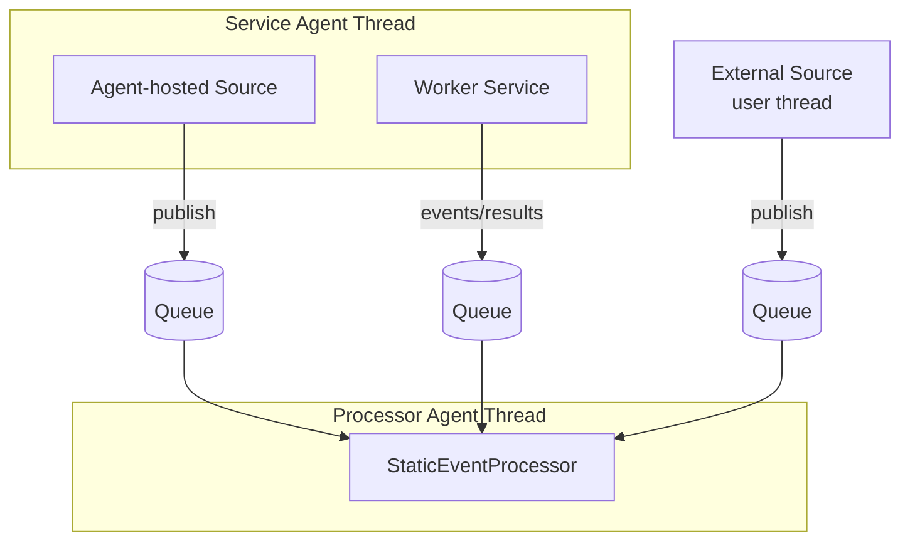

# Agent Execution in Mongoose Server

This document explains what “agent execution” means in Mongoose Server, how it compares to running on a user thread, how
agents are supported in the runtime, and when you would choose agent execution. It also clarifies which components
always execute on agents and which can be hosted either within an agent or on their own threads.

See also:

- Threading model (deep dive): [threading-model.md](threading-model.md)
- Architecture overview: [overview.md](overview.md)
- Event flow: [event-flow.md](event-flow.md)

## 1) What is agent execution?

An agent is a long-lived, cooperative worker that runs on its own looped thread with a configurable idle strategy. In
Mongoose Server, agents host components and repeatedly invoke their `doWork()` or process one event cycle at a time.

Key properties:

- Dedicated thread per agent group: Agents typically map to named threads (processor groups, service groups, scheduler).
- Cooperative, non-blocking style: Components hosted by an agent should do bounded, non-blocking work and return control
  to the loop.
- Deterministic ownership: State mutated by a processor on its agent thread is single-threaded by design.

Minimal mental model: An agent is the execution context that owns a component’s work loop. You configure which
components are hosted by which agent thread.

## 2) Agent execution vs. running on a user thread

Sometimes you may write code that runs on a “user thread” (e.g., a thread you create yourself or a thread provided by a
third-party client library). Here’s a comparison:

Advantages of agent execution

- Single-threaded event handling: Processors execute events on a dedicated agent thread, avoiding external
  synchronization inside handlers.
- Uniform lifecycle and observability: Agents participate in the server lifecycle (
  `init → start → startComplete → stop → tearDown`) and are visible with consistent names, logs, and metrics.
- Backpressure and dispatch integration: Publishing to processors uses Mongoose’s queues and policies (
  `EventToQueuePublisher`), ensuring safe cross-thread handoff.
- Tunable latency and CPU use: Idle strategies (busy spin, yielding, backoff, sleeping) can be chosen per agent group;
  see [threading-model.md](threading-model.md#10-idle-strategies-and-host-environment-impact).

Advantages of user-thread execution

- Simplicity for external libraries: Some client libraries insist on calling you back on their own threads; you may keep
  their callbacks there and publish into Mongoose as needed.
- Blocking operations: If you must perform blocking IO, doing it on a user-managed thread can avoid stalling an agent
  loop.

Trade-offs

- Shared-state safety: On a user thread, you must not mutate processor-owned state directly; marshal work into the
  processor via events.
- Observability: Work on user threads may not automatically appear under agent metrics/logging.
- Scheduling: Agent threads offer fine-grained control (idle strategies, core pinning) that you won’t get on arbitrary
  user threads.

## 3) How agents are supported in Mongoose Server

Mongoose provides several agent types and ways to host components:

- Processor Agent Groups: Host one or more `StaticEventProcessor` instances. All event handlers run here.
- Service Agent Groups: Host worker services and optional agent-hosted event sources.
- Scheduler Agent: Runs the deadline wheel (`DeadWheelScheduler`) for timed tasks.

Event publication between threads uses single-producer/single-consumer queues coordinated by the `EventFlowManager` and
`EventToQueuePublisher`.

Configuration

- Programmatic: Use `MongooseServerConfig` and `ThreadConfig` to declare agent threads, names, and idle strategies.
- YAML style: Equivalent declarations exist for feeds/handlers/sinks and agent threads.

Example (Java builder):

```java
import com.telamin.mongoose.config.MongooseServerConfig;
import com.telamin.mongoose.config.EventProcessorGroupConfig;
import com.telamin.mongoose.config.EventProcessorConfig;
import com.telamin.mongoose.config.EventFeedConfig;
import com.telamin.mongoose.config.ThreadConfig;
import com.fluxtion.agrona.concurrent.BusySpinIdleStrategy;

MongooseServerConfig mongooseServerConfig = MongooseServerConfig.builder()
    .addThread(ThreadConfig.builder()
        .agentName("processor-agent")
        .idleStrategy(new BusySpinIdleStrategy())
        .build())
    .addThread(ThreadConfig.builder()
        .agentName("service-agent")
        .build())
    // add processors/feeds/sinks as required
    .build();
```

See:

- Processor agent: `ComposingEventProcessorAgent`
- Service agent: `ComposingServiceAgent`
- Scheduler agent: `DeadWheelScheduler`
- Queue publisher: `EventToQueuePublisher`

## 4) When to choose agent execution

Use agent execution when any of the following apply:

- You need deterministic, single-threaded event processing for business logic (all event handlers).
- You want low-latency, predictable scheduling with an appropriate idle strategy.
- You need integrated lifecycle and observability of long-running workers.
- You need to safely cross threads between publishers and processors using the built-in queues.

Consider user threads when:

- A third-party library forces callbacks on its own threads and you just relay results into Mongoose.
- You perform blocking IO that shouldn’t run on an agent loop; isolate blocking work and publish results into a
  processor.

Hybrid approach:

- Host lightweight, non-blocking services or sources inside a service agent group.
- Run heavy, blocking connectors on their own threads and use `EventToQueuePublisher` to feed processors.

## 5) What runs where: handlers, feeds, sinks, and services

- Event handlers: Always execute on processor agent threads. Every invocation of a handler (e.g., `handleEvent`) occurs
  within the processor’s agent context.
- Feeds (event sources): Can run inside a service agent (agent-hosted source) or on their own threads (e.g.,
  library-managed IO threads). Either way, they publish into processor queues.
- Services: Can be agent-hosted (cooperative `doWork()` in a service agent group) or run on their own threads if they
  are external/blocked; publish back to processors for state changes.
- Sinks: Can be agent-hosted (as services) or run on their own threads, consuming outputs produced by processors.

Small diagram



Implications:

- Treat processor state as single-threaded and only mutate it from events delivered into the processor.
- From services/feeds/scheduler/user threads, publish an event to affect a processor; don’t directly mutate handler
  state.

## 6) Practical tips

- Choose idle strategies per agent based on latency and CPU requirements;
  see [threading-model.md](threading-model.md#10-idle-strategies-and-host-environment-impact).
- Avoid blocking operations inside agent `doWork()` and inside handler event methods; offload to separate
  threads/services and publish results back.
- Name agent groups meaningfully for easier ops (logs, metrics, core pinning).
- For periodic work in a processor, prefer scheduler-driven triggers over sleeping.

## 7) FAQ

- Do all event handlers run on agents?
    - Yes. All handler callbacks execute on processor agent threads.
- Can a sink run inside an agent?
    - Yes. A sink can be a service hosted in a service agent, or it can run on its own thread.
- Can an event feed be agent-hosted?
    - Yes. Agent-hosted sources are common; external user-thread sources can also publish safely into processors.

## 8) See also

- Threading model: [threading-model.md](threading-model.md)
- Architecture overview: [overview.md](overview.md)
- Event flow: [event-flow.md](event-flow.md)
- How to core-pin agent threads: [how to core pin threads](../example/how-to/how-to-core-pin.md)
