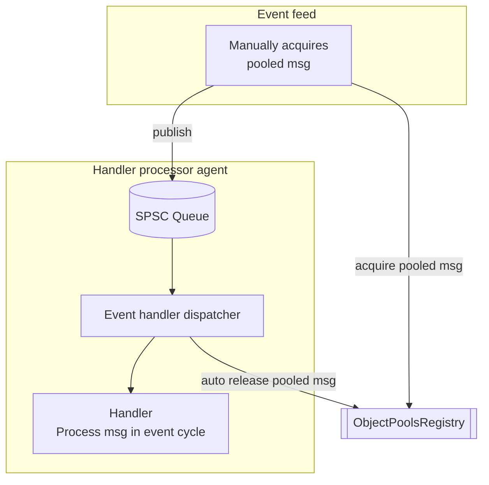
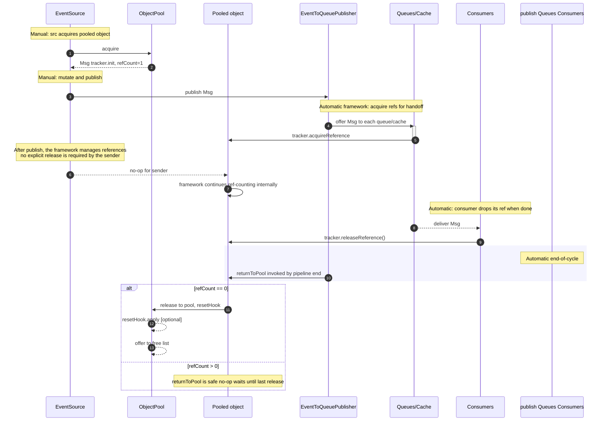
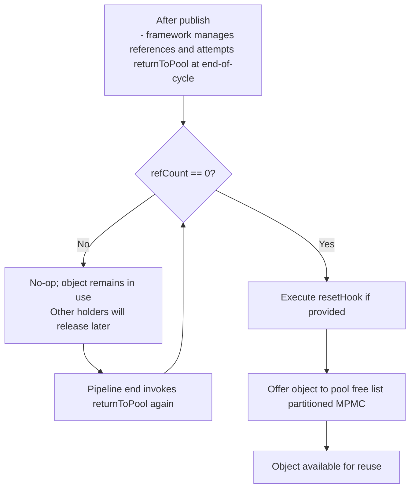

# Object pooling architecture


This document describes how the Mongoose Server object pool works under the hood. It is intended for developers who need
a deeper understanding of reference counting, pooling queues, partitions, and integration points with the runtime.


- PoolAware: marker interface implemented by pooled objects. Implementations must expose a PoolTracker via getPoolTracker(). The framework manages lifecycle; event authors do not need to use try-with-resources.

- PoolTracker: manages reference counting for a pooled object and coordinates return to the originating pool.
    - acquireReference(): increment the reference count.
    - releaseReference(): decrement the reference count; never returns to the pool by itself.
    - returnToPool(): explicitly attempt to return the object to its pool, but only succeeds when the current reference count is zero. The method is idempotent and concurrency-safe; early calls are a no-op until the count reaches zero.
- ObjectPool<T extends PoolAware>: creates and recycles instances of T. When an instance is acquired, its PoolTracker is initialised with the originating pool and the reset hook, and ref count is set. When returned, an optional reset hook is invoked and the instance is placed on the pool’s free list.
- ObjectPools: a shared registry mapping a class to a single ObjectPool instance. Provides convenient getOrCreate overloads to configure capacity and partitions.

## Diagram of object pooling flow 



## Capacity, partitions, and queues

- Capacity: the total number of instances that may be created for a given class. The pool will create on demand up to the configured capacity.
- Partitions: the pool’s free list is partitioned to reduce cross-thread contention; each partition is a bounded, lock-free MPMC queue using com.fluxtion.agrona.concurrent.ManyToManyConcurrentArrayQueue.
- Default partitions: by default, partitions ~= min(available processors, 8) rounded to a power of two. You can specify both capacity and partitions explicitly via ObjectPools.getOrCreate(type, factory, reset, capacity, partitions).

### Free list
- The pool maintains an array of MPMC queues (freePartitions). The current thread computes a home partition index and tries to poll/offer there first, then steals from others under pressure.
- Offer never blocks permanently: if a partition is temporarily full, the pool rotates to the next partition to avoid stalls.

## Lifecycle and reference counting

- Acquire: pool.acquire() returns a pooled instance. Internally, if a free instance is available it is used; otherwise, the pool may create a new instance up to capacity. The instance’s tracker.init(...) sets refCount to 1 and clears the returned flag.
- Additional references: any component that intends to hold a reference (e.g., a queue, cache, or consumer) must call acquireReference() and later releaseReference().
- Origin release: no action is required by the sender. After publish, the framework takes ownership of reference management (it acquires the necessary references for queues/caches and releases them later). The end of the event cycle will attempt returnToPool(); actual return occurs once the reference count reaches zero.
- Returning to pool: returnToPool() will only actually free the instance when the reference count is zero. It is safe to call multiple times and from multiple threads; only the first successful attempt after the count has reached zero will return the object.
- Reset: an optional reset hook is invoked just before an instance is placed on the free list, allowing the caller to clear state.

## Integration with dispatch/pipeline

- EventToQueuePublisher and caches: when caching is enabled, the publisher detaches the pooled instance from the pool (via PoolTracker.removeFromPool), immediately replaces it with a fresh instance in the pool, and then stores the original object in the cache. For each queue write, a reference is acquired just before a successful offer and released on failure/abandonment.
- Consumers: upon finishing processing, consumers releaseReference().
- End of cycle: the pipeline invokes returnToPool() after dispatch to processors; pooled events return automatically once all references (origin + queues + cache + consumers) are released.

## Threading model and safety

- Multi-producer/multi-consumer: the pool’s free list is MPMC with partitioning to reduce cache contention.
- Reference counting is maintained via atomics in PoolTracker; it is safe under concurrent acquire/release/return operations.
- Early return: calling returnToPool() before the count reaches zero is a safe no-op; final return occurs when the last holder releases.

## Configuration notes

- Default capacity is 256. Busy pipelines with multiple queues may benefit from 1024+, or higher for very high fan-out. Using powers of two is recommended.
- Example configuration:

```java
ObjectPool<MyType> pool = Pools.SHARED.getOrCreate(
    MyType.class,
    MyType::new,
    obj -> obj.reset(),
    1024, // capacity
    8     // partitions (power of two recommended)
);
```

## Related source

- [PoolAware](https://github.com/gregv12/fluxtion-server/tree/main/src/main/java/com/telamin/mongoose/service/pool/PoolAware.java)
- [PoolTracker](https://github.com/gregv12/fluxtion-server/tree/main/src/main/java/com/telamin/mongoose/service/pool/impl/PoolTracker.java)
- [ObjectPool](https://github.com/gregv12/fluxtion-server/tree/main/src/main/java/com/telamin/mongoose/service/pool/ObjectPool.java)
- [ObjectPoolsRegistry](https://github.com/gregv12/fluxtion-server/blob/main/src/main/java/com/telamin/mongoose/service/pool/ObjectPoolsRegistry.java)
- End-to-end example using a pooled EventSource: [PoolEventSourceServerExample.java](https://github.com/gregv12/fluxtion-server/blob/main/src/test/java/com/telamin/mongoose/example/objectpool/PoolEventSourceServerExample.java)


## Where object pooling interjects (sequence)



## Manual vs automatic checklist

- Manual (EventSource author):
    - Acquire from pool: pool.acquire()
    - Set fields on the pooled object
    - Publish to the framework (publisher.publish(msg))
    - The publisher MAY NOT continue to use the object after it has been published within its method scope; the framework manages references from the point of publish onward.
    - No explicit release is required from the origin after publish; the framework manages references and returns the object at end-of-cycle once all holders have released.
    - Do not retain the object beyond the event cycle; copy data if needed.

- Manual (any out-of-band holder):
    - If you take ownership outside the normal pipeline, call tracker.acquireReference() and later tracker.releaseReference().

- Automatic (framework):
    - Publisher acquires an extra reference for each successful queue/cache offer, and releases on failure/abandonment.
    - Consumers release their reference when processing completes.
    - The pipeline calls returnToPool() at the end of the event cycle; actual return only occurs when refCount reaches zero.
    - Reset hook executes before the object is placed back on the free list.

## Return-to-pool decision (flow)


