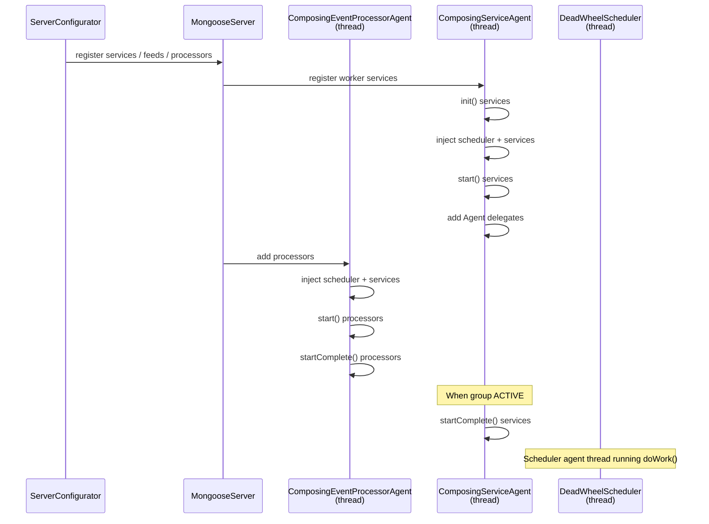
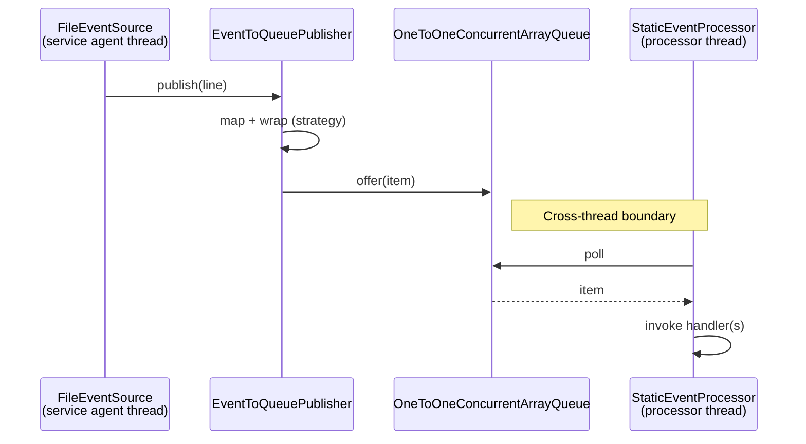

# Guide: Mongoose server Threading Model

This guide explains how Mongoose server uses threads to run your event processors, services, event sources, and the
built‑in scheduler. It focuses on where your code executes, how agents communicate, and how to design components that
are correct and performant under the single‑threaded processor model.

You’ll learn:

- Agent groups and their threads (processor groups, worker/service groups, scheduler)
- Single‑thread rule for processors and why it matters
- How event sources publish to processors (queues and wrapping)
- Lifecycle timing (init → start → startComplete → stop → tearDown)
- Where callbacks execute (processor thread vs service thread vs scheduler thread)
- How to safely hand work across threads (EventToQueuePublisher, ScheduledTriggerNode)

References in this repository:

- Processor
  agent: [ComposingEventProcessorAgent](https://github.com/gregv12/fluxtion-server/blob/main/src/main/java/com/telamin/mongoose/dutycycle/ComposingEventProcessorAgent.java)
- Service
  agent: [ComposingServiceAgent](https://github.com/gregv12/fluxtion-server/blob/main/src/main/java/com/telamin/mongoose/dutycycle/ComposingServiceAgent.java)
- Scheduler
  agent: [DeadWheelScheduler](https://github.com/gregv12/fluxtion-server/blob/main/src/main/java/com/telamin/mongoose/service/scheduler/DeadWheelScheduler.java)
- Event source
  base: [AbstractEventSourceService](https://github.com/gregv12/fluxtion-server/blob/main/src/main/java/com/telamin/mongoose/service/extension/AbstractEventSourceService.java) (+
  agent variant)
- Queue
  publisher: [EventToQueuePublisher](https://github.com/gregv12/fluxtion-server/blob/main/src/main/java/com/telamin/mongoose/dispatch/EventToQueuePublisher.java)

## 1) Big picture

Mongoose server composes several “agents,” each typically running on its own thread:

- One or more Processor Agent Groups (each contains one or more StaticEventProcessor instances)
- One or more Service Agent Groups (each hosts zero or more worker services)
- One Scheduler Agent (the deadline wheel)
- Optional Agent‑hosted event sources (e.g., FileEventSource)

Data is handed between agents through lock‑free single‑producer/single‑consumer queues managed by EventFlowManager and
EventToQueuePublisher. Each processor runs single‑threaded on its agent thread — your processor code is not concurrently
executed by multiple threads.

### Component/Thread overview

```mermaid
flowchart TD
    subgraph ServiceAgentGroup [Service Agent Group thread]
        ES1[Agent-hosted Event Source]
        WS1[Worker Service A]
        WS2[Worker Service B]
    end

    subgraph ProcessorAgentGroup [Processor Agent Group thread]
        P1[StaticEventProcessor #1]
        P2[StaticEventProcessor #2]
    end

    subgraph SchedulerAgent [Scheduler Agent thread]
        Svc[DeadWheelScheduler]
    end

    ES1 -- publish via EventToQueuePublisher --> Q1[(Queue: fileFeed)] --> P1
    ES1 -- publish via EventToQueuePublisher --> Q2[(Queue: fileFeed)] --> P2
    WS1 -- optional publish/events --> Q3[(Queue: serviceFeed)] --> P1
    Svc -- expiry Runnable --> WS1
    Svc -- expiry Runnable --> ES1

    style ServiceAgentGroup fill:#234,stroke:#88a
    style ProcessorAgentGroup fill:#418,stroke:#8a8
    style SchedulerAgent fill:#333,stroke:#a88
```



Notes:

- Each Agent Group is a thread that can host multiple components.
- Event publication crosses threads via queues. The publisher thread enqueues, the subscriber processor dequeues on its
  own thread.
- Scheduler expiry actions run on the scheduler agent thread; to affect a processor, schedule a trigger that publishes
  into the processor or use `ScheduledTriggerNode`.

## 2) Lifecycle and when things start

All lifecycle participants (event sources, processors, services) follow this sequence:

- `init()` — light setup
- `start()` — allocate resources; event sources may enable pre‑start caching
- `startComplete()` — system is ready; sources replay caches and switch to publishing
- `stop()` — stop work, flush/close resources
- `tearDown()` — final cleanup

Processor and service agents add their components and then call `startComplete()` once the group is active.

### Startup sequence (high level)



## 3) Event dispatch path

Agent‑hosted event sources (e.g., `FileEventSource`) typically publish on their own thread. The data is mapped/wrapped
by `EventToQueuePublisher` and offered to one or more target queues. Processors consume from those queues on their own
agent thread.



Key details:

- `EventWrapStrategy` controls whether items are wrapped in `NamedFeedEvent` or sent raw.
- If `cacheEventLog` is enabled in the publisher, events are recorded and replayed on `startComplete()`.
- `EventToQueuePublisher` bounds spin when queues are contended to avoid blocking publishers; slow consumers are warned.

## 4) Where does my code run?

- Processor event handlers (e.g., `ObjectEventHandlerNode#handleEvent`) run on the Processor Agent Group thread.
- Agent‑hosted services and agent‑hosted event sources run their `doWork()` on the Service Agent Group thread that hosts
  them.
- Scheduler expiry actions run on the Scheduler Agent thread.
- Admin commands registered within a processor context are delivered into that processor’s queue and executed on its
  thread; otherwise they execute on the caller thread.

Implications:

- Inside a processor, your state is single‑threaded — no external synchronization is required for state mutated only by
  that processor.
- To update a processor from another thread (service, scheduler), publish an event into the processor’s queue. Don’t
  directly mutate processor state from other threads.

## 5) Moving work between threads safely

Common patterns to marshal work back into a processor context:

- Event publication from services/sources using `EventToQueuePublisher` (via an `EventSource` or an admin command routed
  to a processor queue).
- Use `ScheduledTriggerNode` to schedule a new event cycle into the processor after a delay; the trigger causes
  `fireNewEventCycle()` to run on the processor thread.

Example using `ScheduledTriggerNode`:

```java
public class MySchedulerAwareHandler extends ObjectEventHandlerNode {
    private final ScheduledTriggerNode trigger = new ScheduledTriggerNode();

    // After wiring, call this from handleEvent or during start
    void scheduleTick(long millis) {
        trigger.triggerAfterDelay(millis); // later causes a new event cycle on this processor thread
    }
}
```

## 6) Best practices

- Keep `Agent#doWork()` non‑blocking; do small chunks and return 0 when idle.
- Don’t call blocking IO from processor event handlers; offload to a worker service and publish results back.
- For periodic tasks, prefer the scheduler (rescheduling pattern) over sleeping in `doWork()`.
- Guard verbose logging in hot paths with `log.isLoggable(...)` or cached flags.
- If you need pre‑start replay, enable publisher caching in your source’s `start()` and call `dispatchCachedEventLog()`
  on `startComplete()`.
- Use meaningful agent group names and idle strategies in `MongooseServerConfig` for observability and performance tuning.

## 7) Glossary of threads

- Processor Agent Group thread: runs one or more `StaticEventProcessor` instances (single‑threaded event handling).
- Service Agent Group thread: runs worker services and agent‑hosted event sources (`Agent#doWork`).
- Scheduler Agent thread: runs `DeadWheelScheduler` and executes expiry `Runnable`s.

## 8) Related docs

- Using the scheduler service: [using-the-scheduler-service](../how-to/how-to-using-the-scheduler-service.md)
- Writing an event source plugin: [writing-an-event-source-plugin](../plugin/writing-an-event-source-plugin.md)
- Writing a service plugin: [writing-a-service-plugin](../plugin/writing-a-service-plugin.md)
- Writing an admin command: [writing-an-admin-command](../how-to/writing-an-admin-command.md)
- How to core‑pin agent threads: [how-to-core-pin](../how-to/how-to-core-pin.md)
- Architecture + sequence diagrams: [architecture](index.md)

## 9) Optional: Core pinning for agent threads

Mongoose server supports best-effort CPU core pinning for agent threads. This can help reduce context switches and
improve tail latency on systems where CPU affinity is desirable.

Key points:

- Configure per-agent core pinning using MongooseServerConfig’s agent
  Threads: [ThreadConfig](https://github.com/gregv12/fluxtion-server/blob/main/src/main/java/com/telamin/mongoose/config/ThreadConfig.java)
  has an optional coreId field (zero-based CPU index).
- Pinning is applied inside the agent thread itself during start (onStart) for both processor and service agent groups:
    - Processor
      agent: [ComposingEventProcessorAgent](https://github.com/gregv12/fluxtion-server/blob/main/src/main/java/com/telamin/mongoose/dutycycle/ComposingEventProcessorAgent.java)
    - Service
      agent: [ComposingServiceAgent](https://github.com/gregv12/fluxtion-server/blob/main/src/main/java/com/telamin/mongoose/dutycycle/ComposingServiceAgent.java)
- Mongoose uses a lightweight
  helper [CoreAffinity](https://github.com/gregv12/fluxtion-server/blob/main/src/main/java/com/telamin/mongoose/internal/CoreAffinity.java)
  that attempts to pin via reflection to OpenHFT’s Affinity library if present; otherwise it logs and no-ops.

Configure via fluent builder:

```java
import com.telamin.mongoose.config.MongooseServerConfig;
import com.telamin.mongoose.config.ThreadConfig;
import com.fluxtion.agrona.concurrent.BusySpinIdleStrategy;

MongooseServerConfig mongooseServerConfig = MongooseServerConfig.builder()
    // Configure processor agent group thread
    .addThread(ThreadConfig.builder()
        .agentName("processor-agent")
        .idleStrategy(new BusySpinIdleStrategy())
        .coreId(0) // pin to CPU core 0 (zero-based index)
        .build())
    // Configure service agent group thread
    .addThread(ThreadConfig.builder()
        .agentName("service-agent")
        .coreId(2) // pin to CPU core 2
        .build())
    // ... add groups/feeds/services as usual
    .build();
```

Runtime behavior:

- When an agent group thread starts, the server resolves the configured core for that agent via
  MongooseServer.resolveCoreIdForAgentName and calls CoreAffinity.pinCurrentThreadToCore(coreId). If no coreId is
  configured, nothing is done.
- If OpenHFT’s Affinity is not on the classpath, pinning is skipped with an info log.

Optional dependency for pinning:

- To enable actual OS-level pinning, add the test/runtime dependency on OpenHFT Affinity in your project.
  See this repository’s POM for an example test-scoped optional
  dependency: [pom.xml](https://github.com/gregv12/fluxtion-server/blob/main/pom.xml) (artifact
  net.openhft:affinity).
- A simple optional test that exercises pinning via reflection is provided
  here: [CoreAffinityOptionalTest](https://github.com/gregv12/fluxtion-server/blob/main/src/test/java/com/telamin/mongoose/internal/CoreAffinityOptionalTest.java).

Notes:

- Core IDs are zero-based and depend on your OS/CPU topology.
- Pinning can improve determinism but may reduce OS scheduling flexibility; benchmark your workload.

## 10) Idle strategies and host environment impact

Agent threads in Mongoose server run a continuous doWork() loop governed by an IdleStrategy. The chosen strategy has
significant effects on latency, CPU utilization, power/thermal behavior, and how the OS or container schedules your
application. Choose deliberately per agent group.

Common strategies (from com.fluxtion.agrona.concurrent, compatible with Agrona styles):

- BusySpinIdleStrategy — tight loop, no yielding. Lowest median latency when work arrives, highest constant CPU usage.
- YieldingIdleStrategy — spin briefly, then Thread.yield(). Lower CPU pressure than pure busy spin; more scheduler
  friendly.
- BackoffIdleStrategy — progressive spin/yield/park sequence. Good latency/CPU balance for mixed workloads.
- SleepingIdleStrategy — sleeps for a configured period when idle. Very low CPU during idle, higher wake-up latency.
- NoOpIdleStrategy — do not idle (return immediately). Use only when an outer loop handles idling.

Effects on the host environment:

- CPU utilization and heat
    - Busy spin holds a CPU core at near 100% even when idle. Expect higher power draw, fan noise (laptops), and thermal
      throttling risk under sustained load.
    - Yield/backoff reduce average CPU when idle; sleeping minimizes it.
- Latency and jitter
    - Busy spin typically provides the lowest queuing latency and the tightest p50–p99 latency distribution.
    - Yield/backoff introduce small, scheduler-dependent jitter; sleeping introduces millisecond-level wake-up delays
      unless tuned very carefully.
- OS scheduler interaction
    - Busy spin competes aggressively for CPU time; on oversubscribed hosts it can starve other processes or itself be
      preempted, causing unpredictable jitter. Consider core pinning and setting process/thread priority where
      appropriate.
    - Yielding strategies cooperate with the scheduler and play nicer alongside other workloads.
- Containers and CPU quotas (cgroups/Kubernetes)
    - With CPU limits, busy spin will quickly consume its quota and be throttled, causing bursty latency (periods of
      fast
      processing followed by enforced idle). Backoff or sleep strategies tend to produce smoother performance under
      quotas.
    - If you request fewer CPUs than busy-spinning threads, expect contention and throttling. Align thread count with
      requested CPU shares/limits.
- Power management and scaling
    - On laptops/cloud VMs, busy spin may prevent CPUs from entering low-power states and can inhibit turbo frequency
      boosts for other cores. Sleeping/backoff allow deeper C-states and can reduce cost in autoscaling setups.
- GC and background services
    - Fully busy-spun cores can reduce headroom for GC, JIT compilation, or sidecar processes. Yield/backoff free slices
      for these activities especially on shared nodes.

Guidance: choosing an idle strategy per agent

- Latency-critical processors (market data, control loops): Prefer BusySpinIdleStrategy on dedicated cores or pinned
  threads. Benchmark p99.9 and tail behavior.
- Mixed IO/compute services: Use BackoffIdleStrategy to balance responsiveness with CPU efficiency.
- Mostly idle background workers or development: Use YieldingIdleStrategy or SleepingIdleStrategy to conserve CPU.
- Under CPU limits/containers: Start with BackoffIdleStrategy; avoid pure busy spin unless cores are dedicated and
  limits are configured to match.

Configuration examples

YAML-style (conceptual):

```yaml
agentThreads:
  - agentName: market-data
    idleStrategy: !!com.fluxtion.agrona.concurrent.BusySpinIdleStrategy {}
  - agentName: background-workers
    idleStrategy: !!com.fluxtion.agrona.concurrent.BackoffIdleStrategy { }
```

Java builder:

```java
import com.telamin.mongoose.config.ThreadConfig;
import com.fluxtion.agrona.concurrent.BackoffIdleStrategy;
import com.fluxtion.agrona.concurrent.BusySpinIdleStrategy;

mongooseServerConfig = mongooseServerConfig.toBuilder()
    .addThread(ThreadConfig.builder()
        .agentName("market-data")
        .idleStrategy(new BusySpinIdleStrategy())
        .build())
    .addThread(ThreadConfig.builder()
        .agentName("background-workers")
        .idleStrategy(new BackoffIdleStrategy())
        .build())
    .build();
```

Observability and testing

- Record CPU usage and latency histograms per agent group when tuning. Validate behavior under the same CPU quotas and
  node types as production.
- Watch for throttling metrics in Kubernetes (cfs_throttled_*); heavy busy spin under limits will cause periodic stalls.
- Consider pairing critical busy-spinning agents with core pinning (see section 9) to reduce interference and context
  switches.
