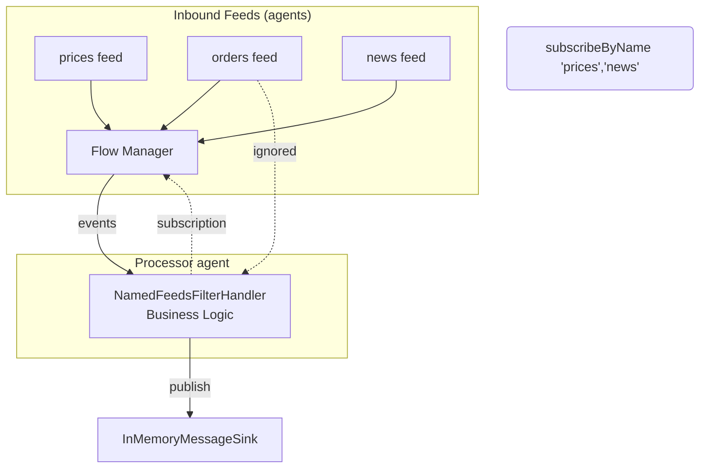

# 5‑minute tutorial: Processing events in a handler with business logic

> **Note:** The complete code for this tutorial is available in the [mongoose-examples repository](https://github.com/telaminai/mongoose-examples/tree/main/gettting-started/five-minute-tutorial). For a more detailed explanation, see the [Five Minute Tutorial README](https://github.com/telaminai/mongoose-examples/blob/main/gettting-started/five-minute-tutorial/README.md).

This quick tutorial shows how to write business logic in an event handler while keeping infrastructure separate. You’ll:

- Add three event feeds (prices, orders, news) and one sink
- Subscribe from the handler by feed name and process events
- Publish results to a sink
- Run it end‑to‑end using the provided test code

Focus: writing business logic in the handler. Infrastructure (feeds/sinks/agents) is configured separately and
injected/wired at boot.

## What we’ll build

- Three in‑memory event feeds: prices, orders, and news
- One in‑memory sink to collect outputs
- A handler that subscribes only to the feeds it cares about and forwards the payloads (your logic goes here)

### Components and event flow



End‑to‑end runnable code (available in the mongoose-examples repository):

* Handler: [NamedFeedsFilterHandler.java](https://github.com/telaminai/mongoose-examples/blob/main/gettting-started/five-minute-tutorial/src/main/java/com/telamin/mongoose/example/fivemin/NamedFeedsFilterHandler.java)
* Main application: [FiveMinuteTutorial.java](https://github.com/telaminai/mongoose-examples/blob/main/gettting-started/five-minute-tutorial/src/main/java/com/telamin/mongoose/example/fivemin/FiveMinuteTutorial.java)

## 1) Write the handler (business logic only)

Extend ObjectEventHandlerNode and use @ServiceRegistered to inject a MessageSink<String>. Subscribe to the feeds you
care about by name in start(). Your event handling stays focused on domain logic; no IO code here.

```java
package com.telamin.mongoose.example.fivemin;

import com.fluxtion.runtime.annotations.runtime.ServiceRegistered;
import com.fluxtion.runtime.node.ObjectEventHandlerNode;
import com.fluxtion.runtime.output.MessageSink;

import java.util.Set;

/**
 * Example processor that only subscribes and forwards events from specific named EventFeeds.
 */
public class NamedFeedsFilterHandler extends ObjectEventHandlerNode {

    private final Set<String> acceptedFeedNames;
    private MessageSink<String> sink;

    public NamedFeedsFilterHandler(Set<String> acceptedFeedNames) {
        this.acceptedFeedNames = acceptedFeedNames;
    }

    @ServiceRegistered
    public void wire(MessageSink<String> sink, String name) {
        this.sink = sink;
    }

    @Override
    public void start() {
        acceptedFeedNames.forEach(feedName -> getContext().subscribeToNamedFeed(feedName));
    }

    @Override
    protected boolean handleEvent(Object event) {
        if (sink == null || event == null) {
            return true;
        }
        if (event instanceof String feedName) {
            sink.accept(feedName);
        }
        // continue processing chain
        return true;
    }
}
```

Key point: the handler depends on MessageSink<String> (an interface) and feed names, not on concrete IO types or
threads.

## 2) Add three feeds and one sink (infrastructure)

- Feeds: InMemoryEventSource<String> named "prices", "orders", and "news"
- Sink: InMemoryMessageSink
- Wire into MongooseServerConfig via EventFeedConfig and EventSinkConfig

Snippet from the runnable test:

```java
// In-memory sink
InMemoryMessageSink memSink = new InMemoryMessageSink();

// Feeds: three named in-memory sources
InMemoryEventSource<String> prices = new InMemoryEventSource<>();
InMemoryEventSource<String> orders = new InMemoryEventSource<>();
InMemoryEventSource<String> news = new InMemoryEventSource<>();

// Processor that only forwards events from feeds: prices, news
NamedFeedsFilterHandler filterHandler = new NamedFeedsFilterHandler(Set.of("prices", "news"));

EventProcessorGroupConfig processorGroup = EventProcessorGroupConfig.builder()
        .agentName("processor-agent")
        .put("filter-processor", new EventProcessorConfig(filterHandler))
        .build();

// Build EventFeed configs with names
EventFeedConfig<?> pricesFeed = EventFeedConfig.builder()
        .instance(prices)
        .name("prices")
        .agent("prices-agent", new BusySpinIdleStrategy())
        .build();

EventFeedConfig<?> ordersFeed = EventFeedConfig.builder()
        .instance(orders)
        .name("orders")
        .agent("orders-agent", new BusySpinIdleStrategy())
        .build();

EventFeedConfig<?> newsFeed = EventFeedConfig.builder()
        .instance(news)
        .name("news")
        .agent("news-agent", new BusySpinIdleStrategy())
        .build();

EventSinkConfig<MessageSink<?>> sinkCfg = EventSinkConfig.<MessageSink<?>>builder()
        .instance(memSink)
        .name("memSink")
        .build();

MongooseServerConfig mongooseServerConfig = MongooseServerConfig.builder()
        .addProcessorGroup(processorGroup)
        .addEventFeed(pricesFeed)
        .addEventFeed(ordersFeed)
        .addEventFeed(newsFeed)
        .addEventSink(sinkCfg)
        .build();

MongooseServer server = MongooseServer.bootServer(mongooseServerConfig);
```


## 3) Run and verify

Publish events into the feeds and observe the sink outputs. Only messages from subscribed feeds are forwarded by the
handler.

```java
// Inside a try-finally block to ensure server is stopped
try {
    prices.offer("p1");
    prices.offer("p2");
    orders.offer("o1"); // ignored filter mismatch
    orders.offer("o2"); // ignored filter mismatch
    news.offer("n1");
    news.offer("n2");

    // Wait for sink messages; should include only p1,p2,n1,n2
    waitForMessages(memSink, 4, 1, TimeUnit.SECONDS);
} finally {
    server.stop();
}

System.out.println("received:");
waitForMessages(memSink, 4, 1, TimeUnit.SECONDS).forEach(System.out::println);

// Helper method to wait for messages
private static List<Object> waitForMessages(InMemoryMessageSink sink, int minCount, long timeout, TimeUnit unit) throws Exception {
    long end = System.nanoTime() + unit.toNanos(timeout);
    while (System.nanoTime() < end) {
        List<Object> lines = sink.getMessages();
        if (lines.size() >= minCount) {
            return lines;
        }
        Thread.sleep(50);
    }
    return sink.getMessages();
}
```

The test waits for the sink to receive the expected messages and asserts the result. You can adapt the handler to
implement your own domain rules (e.g., convert prices into BUY/SELL decisions) without touching the feed or sink code.

## 4) Keep business logic separate from infrastructure

- Handlers do domain work (transform, aggregate, decide)
- Feeds perform inbound IO and publish domain events
- Sinks perform outbound IO and persist/forward decisions
- Use @ServiceRegistered to inject services/sinks by interface
- Subscribe to named feeds rather than concrete sources

This separation lets you swap feeds/sinks (Kafka, files, HTTP), add services (scheduler, admin), or change
threading—without editing your business logic.

## Source code

* Handler: [NamedFeedsFilterHandler.java](https://github.com/telaminai/mongoose-examples/blob/main/gettting-started/five-minute-tutorial/src/main/java/com/telamin/mongoose/example/fivemin/NamedFeedsFilterHandler.java)
* Main application: [FiveMinuteTutorial.java](https://github.com/telaminai/mongoose-examples/blob/main/gettting-started/five-minute-tutorial/src/main/java/com/telamin/mongoose/example/fivemin/FiveMinuteTutorial.java)
* Tests: [NamedFeedsFilterHandlerTest.java](https://github.com/telaminai/mongoose-examples/blob/main/gettting-started/five-minute-tutorial/src/test/java/com/telamin/mongoose/example/fivemin/NamedFeedsFilterHandlerTest.java)
* Detailed README: [Five Minute Tutorial README](https://github.com/telaminai/mongoose-examples/blob/main/gettting-started/five-minute-tutorial/README.md)
