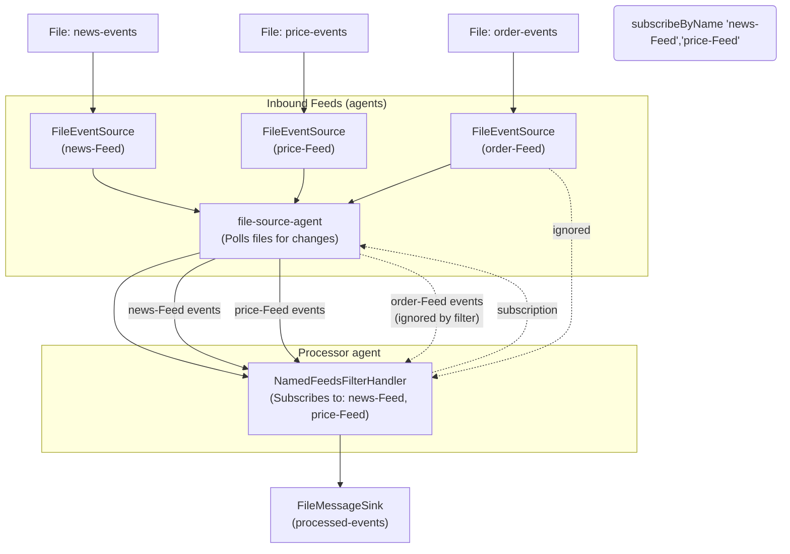

# 5‑minute tutorial: Configuring a Mongoose server with YAML

> **Note:** The complete code for this tutorial is available in
> the [Five Minute YAML Tutorial](https://github.com/telaminai/mongoose-examples/blob/main/getting-started/five-minute-yaml-tutorial/README.md).
> For all examples, see the
> [mongoose-examples repository](https://github.com/telaminai/mongoose-examples/).

This quick tutorial shows how to configure a Mongoose server using YAML instead of programmatic configuration. You'll:

- Configure three file-based event feeds, a filter handler, and a file-based sink using YAML
- Run a long-running server that continuously monitors input files for changes
- Process events from specific named feeds and write results to an output file
- Compare this approach with the programmatic configuration from
  the [5-minute event handler tutorial](five-minute-event-handler-tutorial.md)

Focus: using YAML configuration for a more maintainable and declarative approach to setting up a Mongoose server.

## What we'll build

- Three file-based event feeds: news, prices, and orders
- One file-based sink to collect outputs
- A handler that subscribes only to the news and prices feeds and forwards the payloads
- A long-running server that continuously monitors input files for changes

### Components and event flow



End‑to‑end runnable code (available in the mongoose-examples repository):

* Handler: [NamedFeedsFilterHandler.java](https://github.com/telaminai/mongoose-examples/blob/main/getting-started/five-minute-yaml-tutorial/src/main/java/com/telamin/mongoose/example/fivemin/NamedFeedsFilterHandler.java)
* YAML Configuration: [appConfig.yml](https://github.com/telaminai/mongoose-examples/blob/main/getting-started/five-minute-yaml-tutorial/run/appConfig.yml)
* Run Script: [runMongooseServer.sh](https://github.com/telaminai/mongoose-examples/blob/main/getting-started/five-minute-yaml-tutorial/run/runMongooseServer.sh)

## 1) Modify the handler for YAML configuration

The handler is similar to the one in the [5-minute event handler tutorial](five-minute-event-handler-tutorial.md), but
with a key difference: it uses property injection instead of constructor injection to set the accepted feed names. This
is necessary for YAML configuration, as the YAML deserializer needs to create an instance of the class and then set its
properties.

```java
package com.telamin.mongoose.example.fivemin;

import com.telamin.fluxtion.runtime.annotations.runtime.ServiceRegistered;
import com.telamin.fluxtion.runtime.node.ObjectEventHandlerNode;
import com.telamin.fluxtion.runtime.output.MessageSink;

import java.util.Set;

/**
 * Example processor that only subscribes and forwards events from specific named EventFeeds.
 */
public class NamedFeedsFilterHandler extends ObjectEventHandlerNode {

    private Set<String> acceptedFeedNames;
    private MessageSink<String> sink;

    public void setAcceptedFeedNames(Set<String> acceptedFeedNames) {
        this.acceptedFeedNames = acceptedFeedNames;
    }

    @ServiceRegistered
    public void wire(MessageSink<String> sink, String name) {
        this.sink = sink;
    }

    @Override
    public void start() {
        acceptedFeedNames.forEach(feedName -> getContext().subscribeToNamedFeed(feedName));
    }

    @Override
    protected boolean handleEvent(Object event) {
        if (sink == null || event == null) {
            return true;
        }
        if (event instanceof String feedName) {
            System.out.println("publishing to sink:" + event);
            sink.accept(feedName);
        }
        // continue processing chain
        return true;
    }
}
```

Key differences from the programmatic version:

- No constructor; instead, a setter method for `acceptedFeedNames`
- The `acceptedFeedNames` field is not final, allowing it to be set after construction
- This design enables the YAML deserializer to create an instance and then configure it

## 2) Create a YAML configuration file

Instead of programmatically configuring the Mongoose server, we'll use a YAML file to define the event feeds, sinks, and
handlers. Create a file named `appConfig.yml`:

```yaml
# --------- EVENT INPUT FEEDS BEGIN CONFIG ---------
eventFeeds:
  - instance: !!com.telamin.mongoose.connector.file.FileEventSource
      filename: data-in/news-events
    name: news-Feed
    agentName: file-source-agent

  - instance: !!com.telamin.mongoose.connector.file.FileEventSource
      filename: data-in/price-events
    name: price-Feed
    agentName: file-source-agent

  - instance: !!com.telamin.mongoose.connector.file.FileEventSource
      filename: data-in/order-events
    name: order-Feed
    agentName: file-source-agent
# --------- EVENT INPUT FEEDS END CONFIG ---------


# --------- EVENT SINKS BEGIN CONFIG -------
eventSinks:
  - instance: !!com.telamin.mongoose.connector.file.FileMessageSink
      filename: data-out/processed-events
    name: fileSink
# --------- EVENT SINKS END CONFIG ---------


# --------- EVENT HANDLERS BEGIN CONFIG ---------
eventHandlers:
  - agentName: processor-agent
    eventHandlers:
      example-processor:
        customHandler: !!com.telamin.mongoose.example.fivemin.NamedFeedsFilterHandler
          acceptedFeedNames: [ "news-Feed", "price-Feed" ]
# --------- EVENT HANDLERS END CONFIG ---------
```

The YAML configuration defines:

1. **Event Feeds**: Three file-based event sources that read from text files in the `data-in` directory
2. **Event Sinks**: A file-based message sink that writes to a text file in the `data-out` directory
3. **Event Handlers**: A processor that uses the `NamedFeedsFilterHandler` and configures it to accept events from "
   news-Feed" and "price-Feed" (but not "order-Feed")

Note the use of the `!!` syntax to specify the Java class for each component, and how the `acceptedFeedNames` property
is set directly in the YAML.

## 3) Set up the file-based input/output

Create the input files in a `data-in` directory:

- `news-events`: Contains news events, one per line
- `price-events`: Contains price events, one per line
- `order-events`: Contains order events, one per line

Example content of `news-events`:

```
news 1
news 2
news 3
```

The `FileEventSource` runs on a dedicated agent thread (specified by `agentName: file-source-agent` in the YAML
configuration) and continuously polls the files for new data. Each time a new line is added to a file, the source reads
it and publishes it as an event into the system.

The files have associated read pointers (stored as `.readPointer` files in the same directory), which track the position
where the application last read from. This ensures that when the application restarts, old data is not re-read.

Create a `data-out` directory for the output file:

- `processed-events`: Will contain the processed events from the "news-Feed" and "price-Feed" feeds

The `FileMessageSink` writes each processed event to this file.

## 4) Run the application

To run the application, execute the script `runMongooseServer.sh`:

```bash
cd run
./runMongooseServer.sh
```

This is a long-running application, so any additions to the input files will be read and pushed to the handler and the
connected sink. To stop the application, press `Ctrl+C`.

## 5) Clean up after a run

Run the cleanup script when you want to start fresh:

```bash
cd run
./cleanup.sh
```

This deletes all `.readPointer` files in the `data-in` directory and removes all files from the `data-out` directory,
allowing you to start fresh with a new run of the application.

## How it works

1. The application loads the YAML configuration from `appConfig.yml` using the system property
   `mongooseServer.config.file`
2. It sets up three file-based event sources, each reading from a different input file
3. It configures a filter handler that only subscribes to the "news-Feed" and "price-Feed" feeds
4. It sets up a file-based message sink that writes to the output file
5. When the application starts, it reads the existing content of the input files (if any) and processes it
6. As new content is added to the input files, it is automatically read and processed
7. Only events from the "news-Feed" and "price-Feed" feeds are processed and written to the output file

## Comparing programmatic and YAML configuration

### Programmatic configuration (from the 5-minute event handler tutorial):

```java
// Build in-memory feeds and sink
InMemoryEventSource<String> prices = new InMemoryEventSource<>();
InMemoryEventSource<String> orders = new InMemoryEventSource<>();
InMemoryEventSource<String> news = new InMemoryEventSource<>();
InMemoryMessageSink memSink = new InMemoryMessageSink();

// Create handler with constructor injection
NamedFeedsFilterHandler filterHandler = new NamedFeedsFilterHandler(Set.of("prices", "news"));

// Configure processor, feeds, and sink
EventProcessorGroupConfig processorGroup = EventProcessorGroupConfig.builder()
        .agentName("processor-agent")
        .put("filter-processor", new EventProcessorConfig(filterHandler))
        .build();

EventFeedConfig<?> pricesFeed = EventFeedConfig.builder()
        .instance(prices)
        .name("prices")
        .agent("prices-agent", new BusySpinIdleStrategy())
        .build();

// ... similar configuration for orders and news feeds

EventSinkConfig<MessageSink<?>> sinkCfg = EventSinkConfig.<MessageSink<?>>builder()
        .instance(memSink)
        .name("memSink")
        .build();

MongooseServerConfig mongooseServerConfig = MongooseServerConfig.builder()
        .addProcessorGroup(processorGroup)
        .addEventFeed(pricesFeed)
        .addEventFeed(ordersFeed)
        .addEventFeed(newsFeed)
        .addEventSink(sinkCfg)
        .build();

MongooseServer server = MongooseServer.bootServer(mongooseServerConfig);
```

### YAML configuration (from this tutorial):

```yaml
eventFeeds:
  - instance: !!com.telamin.mongoose.connector.file.FileEventSource
      filename: data-in/news-events
    name: news-Feed
    agentName: file-source-agent

  # ... similar configuration for price-Feed and order-Feed

eventSinks:
  - instance: !!com.telamin.mongoose.connector.file.FileMessageSink
      filename: data-out/processed-events
    name: fileSink

eventHandlers:
  - agentName: processor-agent
    eventHandlers:
      example-processor:
        customHandler: !!com.telamin.mongoose.example.fivemin.NamedFeedsFilterHandler
          acceptedFeedNames: [ "news-Feed", "price-Feed" ]
```

### Key differences:

1. **Declarative vs. Imperative**: YAML configuration is declarative, focusing on what the system should look like
   rather than how to build it step by step.
2. **Separation of Configuration and Code**: YAML configuration separates the configuration from the code, making it
   easier to modify the configuration without changing the code.
3. **File-Based vs. In-Memory**: This example uses file-based event sources and sinks instead of in-memory ones, making
   it suitable for long-running applications.
4. **Property Injection vs. Constructor Injection**: The handler in the YAML example uses property injection instead of
   constructor injection, allowing it to be instantiated by the YAML deserializer.
5. **Long-Running vs. Short-Lived**: The YAML-configured application is designed to run continuously, monitoring input
   files for changes, while the programmatic example is more suited for short-lived, in-memory processing embedded in other 
    applications.

## Source code

* Handler: [NamedFeedsFilterHandler.java](https://github.com/telaminai/mongoose-examples/blob/main/getting-started/five-minute-yaml-tutorial/src/main/java/com/telamin/mongoose/example/fivemin/NamedFeedsFilterHandler.java)
* YAML Configuration: [appConfig.yml](https://github.com/telaminai/mongoose-examples/blob/main/getting-started/five-minute-yaml-tutorial/run/appConfig.yml)
* Run Script: [runMongooseServer.sh](https://github.com/telaminai/mongoose-examples/blob/main/getting-started/five-minute-yaml-tutorial/run/runMongooseServer.sh)
* Cleanup Script: [cleanup.sh](https://github.com/telaminai/mongoose-examples/blob/main/getting-started/five-minute-yaml-tutorial/run/cleanup.sh)
* Detailed  README: [Five Minute YAML Tutorial README](https://github.com/telaminai/mongoose-examples/blob/main/getting-started/five-minute-yaml-tutorial/README.md)