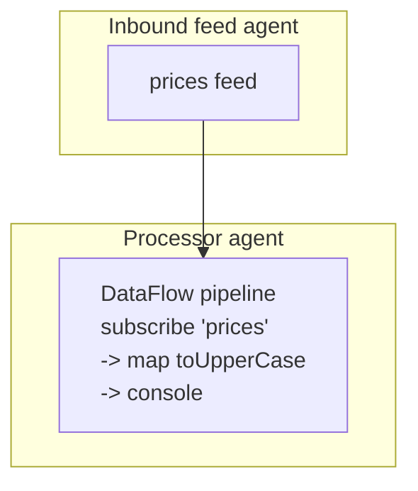

# Getting started: Stream programming with Fluxtion DataFlow

> A runnable example of this tutorial here: 
> [Stream programming tutorial](https://github.com/telaminai/mongoose-examples/tree/main/getting-started/stream-programming-tutorial).<br>
> For all examples, see: [mongoose-examples repository](https://github.com/telaminai/mongoose-examples/).


This guide shows how to build dataflow pipelines that connect feeds (sources) to functional logic and sinks (outputs)
with minimal infrastructure code. The programming model mirrors Java Streams: you compose transformations, filters, and
aggregates, then connect to inbound feeds and outbound sinks. Native support for Fluxtion DataFlow in Mongoose makes
integration straightforward.

What you’ll do:

- Define a small functional pipeline using DataFlow operators (map, filter, window/aggregate)
- Connect the pipeline to named feeds and sinks provided by Mongoose
- Run the flow end‑to‑end and observe results

Focus: declarative, stream‑style logic; operational wiring (agents, threads, IO) is configured for you.

## What we’ll build

- One in‑memory source producing strings on a feed named "prices"
- Stream logic: subscribe to the feed, map to upper-case, and print to console
- Output: console logging

### Components and event flow



End‑to‑end runnable code (see mongoose-examples repository):

- Main application: StreamProgrammingTutorial.java

## 1) Write the stream pipeline (functional logic)

The example uses Fluxtion DataFlow’s builder to subscribe to a named feed and compose operators inline.

Snippet from the example main:

```java
import com.fluxtion.compiler.builder.dataflow.DataFlow;
import com.telamin.fluxtion.runtime.EventProcessor;

// build data stream processor subscribing to prices feed, 
// with a simple map function and console output
EventProcessor<?> processor = (EventProcessor) DataFlow
        .subscribeToFeed("prices", String.class)
        .map(String::toUpperCase)
        .console("Hello, {}")
        .build();
```

Key points:

- DataFlow.subscribeToFeed("prices", String.class) subscribes to the named feed.
- map(String::toUpperCase) transforms the payload.
- console("Hello, {}") prints formatted output.

## 2) Provide a feed and boot the server 

The example source:

```java
public static void main(String[] args) {
    // build data stream processor subscribing to prices feed,
    // with a simple map function and console output
    var processor = (EventProcessor) DataFlow
            .subscribeToFeed("prices", String.class)
            .map(String::toUpperCase)
            .console("Hello, {}")
            .build();

    var eventProcessorConfig = EventProcessorConfig.builder()
            .name("filter-processor")
            .handler(processor)
            .build();

    // Build EventFeed configs with name: 'prices'
    var prices = new InMemoryEventSource<>();
    var pricesFeed = EventFeedConfig.builder()
            .instance(prices)
            .name("prices")
            .wrapWithNamedEvent(true)
            .agent("prices-agent", new BusySpinIdleStrategy())
            .build();

    // build server config
    var mongooseServerConfig = MongooseServerConfig.builder()
            .addProcessor("processor-agent", eventProcessorConfig)
            .addEventFeed(pricesFeed)
            .build();

    //boot server
    MongooseServer.bootServer(mongooseServerConfig);

    //send some data
    prices.offer("World!!");
}
```

Notes:

- wrapWithNamedEvent(true) aligns the feed’s naming with DataFlow.subscribeToFeed("prices", ...).
- The example builds the EventProcessor via DataFlow, then passes it as the handler to EventProcessorConfig.

## 3) Run and verify

Publish an event into the feed and observe console output.

```java
// After booting the server and having a reference to prices feed:
prices.offer("World!!");

// Console output will include:
// Hello, WORLD!!
```

## Why stream programming with Mongoose?

- Minimal plumbing: focus on map/filter/window/join logic; Mongoose wires feeds, sinks, and scheduling.
- Java‑stream‑like fluency: readable functional pipelines, but with event‑driven semantics.
- Native Fluxtion DataFlow: the pipeline compiles into an efficient event processor — no reflective overhead on hot path.
- Composable: add more nodes (timers, stateful ops, joins) as your flow grows.
- Portable: swap in Kafka/file/HTTP sources and sinks without touching the processing logic.

## Next steps

- Explore the 5‑minute tutorials for event handlers and YAML configuration:
    - five-minute-event-handler-tutorial.md
    - five-minute-yaml-configuration-tutorial.md
- Browse more DataFlow operators in Fluxtion Runtime documentation.
- Try replacing the in‑memory sources/sinks with file or Kafka adapters in configuration.
