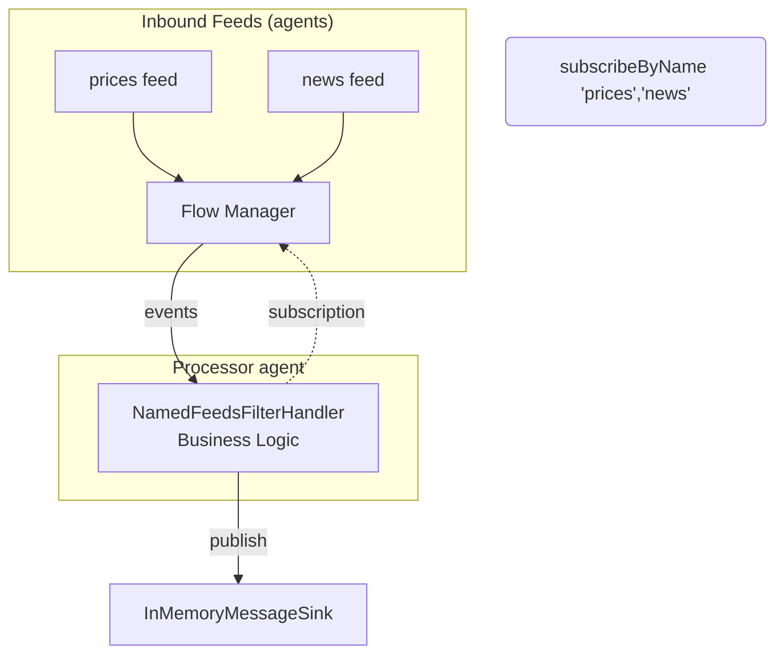

# 5‑minute tutorial: Processing events in a handler with business logic

This quick tutorial shows how to write business logic in an event handler while keeping infrastructure separate. You’ll:

- Add two event feeds (prices, news) and one sink
- Subscribe from the handler by feed name and process events
- Publish results to a sink
- Run it end‑to‑end using the provided test code

Focus: writing business logic in the handler. Infrastructure (feeds/sinks/agents) is configured separately and
injected/wired at boot.

## What we’ll build

- Two in‑memory event feeds: prices and news
- One in‑memory sink to collect outputs
- A handler that subscribes only to the feeds it cares about and forwards the payloads (your logic goes here)

### Components and event flow



End‑to‑end runnable code (already in the repo):

* Feed
  Handler: [NamedFeedsFilterHandler.java]({{source_root}}/test/java/com/telamin/mongoose/example/NamedFeedsFilterHandler.java)
* Wiring +
  test: [NamedFeedsSubscriptionExampleTest.java]({{source_root}}/test/java/com/telamin/mongoose/example/NamedFeedsSubscriptionExampleTest.java)

## 1) Write the handler (business logic only)

Extend ObjectEventHandlerNode and use @ServiceRegistered to inject a MessageSink<String>. Subscribe to the feeds you
care about by name in start(). Your event handling stays focused on domain logic; no IO code here.

```java
package com.telamin.mongoose.example;

import com.fluxtion.runtime.annotations.runtime.ServiceRegistered;
import com.fluxtion.runtime.node.ObjectEventHandlerNode;
import com.fluxtion.runtime.output.MessageSink;

import java.util.Set;

public class NamedFeedsFilterHandler extends ObjectEventHandlerNode {
    private final Set<String> acceptedFeedNames;
    private MessageSink<String> sink;

    public NamedFeedsFilterHandler(Set<String> acceptedFeedNames) {
        this.acceptedFeedNames = acceptedFeedNames;
    }

    @ServiceRegistered
    public void wire(MessageSink<String> sink, String name) {
        this.sink = sink; // business code doesn’t care about sink implementation
    }

    @Override
    public void start() {
        // Subscribe to feeds by name; infra can change without touching this code
        acceptedFeedNames.forEach(feedName -> getContext().subscribeToNamedFeed(feedName));
    }

    @Override
    protected boolean handleEvent(Object event) {
        if (sink == null || event == null) return true;
        if (event instanceof String payload) {
            // Business logic goes here. For the tutorial, just forward the payload.
            sink.accept(payload);
        }
        return true;
    }
}
```

Key point: the handler depends on MessageSink<String> (an interface) and feed names, not on concrete IO types or
threads.

## 2) Add two feeds and one sink (infrastructure)

- Feeds: InMemoryEventSource<String> named "prices" and "news"
- Sink: InMemoryMessageSink
- Wire into MongooseServerConfig via EventFeedConfig and EventSinkConfig

Snippet from the runnable test:

```java
InMemoryMessageSink memSink = new InMemoryMessageSink();

InMemoryEventSource<String> prices = new InMemoryEventSource<>();
prices.setCacheEventLog(true);
InMemoryEventSource<String> news = new InMemoryEventSource<>();
news.setCacheEventLog(true);

NamedFeedsFilterHandler filterHandler = new NamedFeedsFilterHandler(Set.of("prices", "news"));

EventProcessorGroupConfig processorGroup = EventProcessorGroupConfig.builder()
    .agentName("processor-agent")
    .put("filter-processor", new EventProcessorConfig(filterHandler))
    .build();

EventFeedConfig<?> pricesFeed = EventFeedConfig.builder()
    .instance(prices)
    .name("prices")
    .agent("prices-agent", new BusySpinIdleStrategy())
    .build();

EventFeedConfig<?> newsFeed = EventFeedConfig.builder()
    .instance(news)
    .name("news")
    .agent("news-agent", new BusySpinIdleStrategy())
    .build();

EventSinkConfig<MessageSink<?>> sinkCfg = EventSinkConfig.<MessageSink<?>>builder()
    .instance(memSink)
    .name("memSink")
    .build();

MongooseServerConfig mongooseServerConfig = MongooseServerConfig.builder()
    .addProcessorGroup(processorGroup)
    .addEventFeed(pricesFeed)
    .addEventFeed(newsFeed)
    .addEventSink(sinkCfg)
    .build();

MongooseServer server = MongooseServer.bootServer(mongooseServerConfig, rec -> {});
```

Complete and runnable
version [NamedFeedsSubscriptionExampleTest]({{source_root}}/test/java/com/telamin/mongoose/example/NamedFeedsSubscriptionExampleTest.java)

## 3) Run and verify

Publish events into the feeds and observe the sink outputs. Only messages from subscribed feeds are forwarded by the
handler.

```java
prices.offer("p1");
prices.offer("p2");
news.offer("n1");
news.offer("n2");

// Expect: p1, p2, n1, n2 in the sink (order may vary slightly depending on timing)
```

The test waits for the sink to receive the expected messages and asserts the result. You can adapt the handler to
implement your own domain rules (e.g., convert prices into BUY/SELL decisions) without touching the feed or sink code.

## 4) Keep business logic separate from infrastructure

- Handlers do domain work (transform, aggregate, decide)
- Feeds perform inbound IO and publish domain events
- Sinks perform outbound IO and persist/forward decisions
- Use @ServiceRegistered to inject services/sinks by interface
- Subscribe to named feeds rather than concrete sources

This separation lets you swap feeds/sinks (Kafka, files, HTTP), add services (scheduler, admin), or change
threading—without editing your business logic.

## Source code

* Feed
  Handler: [NamedFeedsFilterHandler.java]({{source_root}}/test/java/com/telamin/mongoose/example/NamedFeedsFilterHandler.java)
* Wiring +
  test: [NamedFeedsSubscriptionExampleTest.java]({{source_root}}/test/java/com/telamin/mongoose/example/NamedFeedsSubscriptionExampleTest.java)
