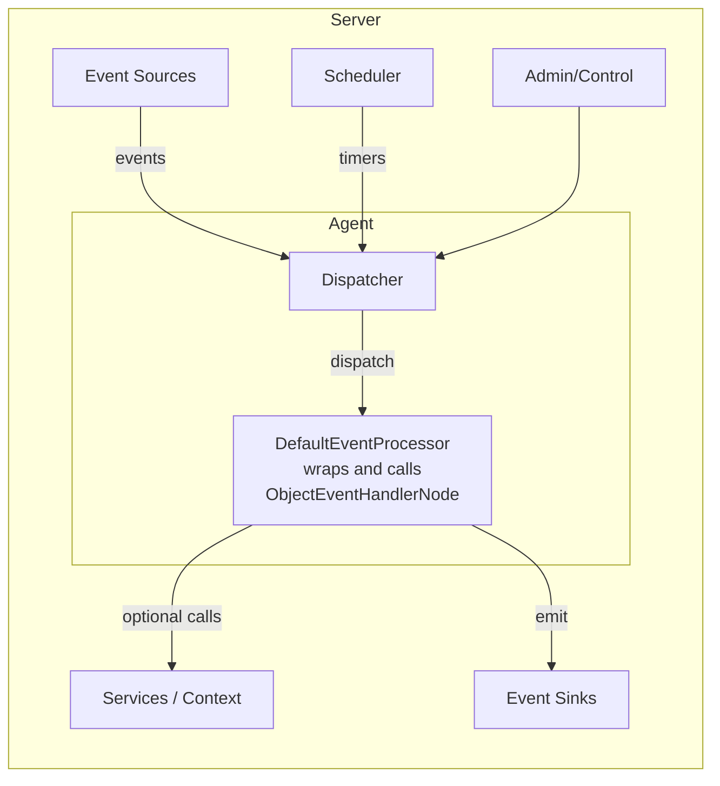

# Event handling and Business Logic

This guide explains where your business logic lives in a Mongoose server application, how events flow, and how two core
building blocks, ObjectEventHandlerNode and DefaultEventProcessor, fit into the server. It also provides practical
guidance on which one to choose, with a pros/cons comparison.

- Audience: engineers and architects designing bespoke event-driven application logic.
- Read this with: "Event source feeds", "Event sink outputs" and "Service functions" for how handlers consume events,
  interact with services and emit events.

## Key ideas

- Business logic processing is triggered when events are received by your event handler (onEvent or typed callbacks).
  Your code runs only when an event arrives or a scheduled trigger fires.
- Business logic runs in a single-threaded event loop per agent. This keeps your logic deterministic and free from
  typical concurrency hazards.
- Your event handling code is isolated from infrastructure plugins (event sources, sinks, schedulers, admin, etc.).
  Infrastructure delivers events and services; your handler focuses on decisions and state.
- Testing is easier: because handlers are pure Java objects with well-defined entry points, you can unit-test them
  without booting the full server.

## Diagram where logic lives

The diagram below shows where DefaultEventProcessor and ObjectEventHandlerNode sit within the server. The server owns
agents and infrastructure; an agent runs a single-threaded event loop that invokes your handler/processor.



Notes:

- The agent’s event loop is single-threaded; your handler/processor runs on that thread.
- ObjectEventHandlerNode focuses on lifecycle/config, handling events and services
- DefaultEventProcessor wraps ObjectEventHandlerNode and can also integrate more deeply with the server and support
  strongly typed callbacks.

## Where to put business logic code

Place your domain logic inside an event handler component that receives events and updates state. In Mongoose server you
typically structure this in one of two ways:

- Implement a handler as an ObjectEventHandlerNode
- Implement a processor by extending DefaultEventProcessor

Both reside in the Mongoose runtime layer and plug into the server’s dispatching and duty-cycle infrastructure. Choosing
between them depends on how deep you want to integrate with the server and what kind of callback/dispatch style you
need.

## ObjectEventHandlerNode (focus on business logic)

ObjectEventHandlerNode is a simple, focused way to write a handler for incoming events. You create your handler by
extending ObjectEventHandlerNode.

- Keep your class small and cohesive; implement onEvent(Object evt) and any typed handlers you choose to expose.
- Has access to processing context via getContext() inherited from its superclass, allowing lookups of shared services
  if needed.
- Implements lifecycle via LifecycleNode; your handler will receive lifecycle callbacks from the server.
- Less
  configuration: [MongooseServerConfig](https://github.com/gregv12/fluxtion-server/blob/main/src/main/java/com/telamin/mongoose/config/MongooseServerConfig.java)
  exposes shortcut
  methods to register ObjectEventHandlerNode-based handlers, reducing boilerplate when wiring.
- Encourages clean separation of concerns: the server handles scheduling, dispatch, and I/O; your handler handles
  decisions.

Why it’s simpler:

- Narrow API surface: fewer concepts to learn before you can write production code.
- Minimal boilerplate: focus on domain state and methods for processing events.
- Easy unit testing: instantiate your handler, call methods, assert state.
- Wiring convenience: MongooseServerConfig shortcuts make handler registration straightforward.

## DefaultEventProcessor (deeper integration and typed callbacks)

DefaultEventProcessor binds at a lower level into the server and provides access to the full processing context,
lifecycle, and interfaces.

- You extend DefaultEventProcessor to participate in server lifecycle and gain access to the context map and internal
  hooks.
- For strongly typed dispatch with interface callbacks, extend DefaultEventProcessor and implement the required
  interface(s). The server can then route typed calls directly (compile-time safety, less casting).
-

Example: [ConfigAwareEventProcessor](https://github.com/gregv12/fluxtion-server/blob/main/src/main/java/com/telamin/mongoose/internal/ConfigAwareEventProcessor.java)
demonstrates a processor that implements ConfigListener and receives configuration updates via strongly typed
callbacks.

When this helps:

- You need server lifecycle integration (init, config, teardown) and access to context objects.
- You want strongly typed, interface-based callbacks for event dispatch.
- You are building reusable infrastructure-like components that must cooperate with the wider server runtime.

## Choosing between them

Below is a practical comparison to help you decide.

| Aspect            | ObjectEventHandlerNode                                        | DefaultEventProcessor                                 |
|-------------------|---------------------------------------------------------------|-------------------------------------------------------|
| Primary goal      | Fast path to business logic                                   | Deep integration with server runtime                  |
| Complexity        | Lower (simple API)                                            | Higher (lifecycle, context, interfaces)               |
| Boilerplate       | Minimal; MongooseServerConfig shortcuts reduce wiring         | More (extend class, implement interfaces)             |
| Typed callbacks   | Optional; can implement interfaces on the handler if desired  | Strongly typed via implemented interfaces             |
| Lifecycle hooks   | Yes, via LifecycleNode on the handler                         | Full lifecycle support                                |
| Access to context | Yes, via getContext() on the handler                          | Full context map and runtime hooks                    |
| Testing ease      | Very easy (plain handler methods)                             | Easy but with more setup                              |
| Best for          | Domain-centric handlers; quick delivery with minimal ceremony | Infrastructure-aware processors needing tight control |

Guidance:

- Prefer ObjectEventHandlerNode when your goal is to deliver business value quickly with clean, testable code and no
  special runtime hooks.
- Prefer DefaultEventProcessor when you require lifecycle participation, typed interface callbacks, or direct use of
  server context/state.

## EventProcessor groups and threading

Mongoose server composes handlers into EventProcessor groups. Many handlers can be partitioned within a group but still
execute
on the same thread. Each EventProcessor group runs on its own agent (single-threaded loop). This means you can move
handlers to different threads/agents by changing configuration, without changing application code.
See [EventProcessorGroupConfig.java](https://github.com/gregv12/fluxtion-server/blob/main/src/main/java/com/telamin/mongoose/config/EventProcessorGroupConfig.java)
for
grouping options.

## Idle strategies

Agents run a duty cycle that can be tuned with an IdleStrategy. A busy-spin strategy yields lowest latency but uses more
CPU. Yielding or sleeping strategies reduce CPU usage at the cost of higher latency. Configure the strategy per
processor when adding it to a group, or via server config. See the IdleStrategy (Agrona-like) and controller APIs
for wiring.

## Configuration lifecycle and ConfigListener

During startup the server distributes configuration to processors and handlers that implement ConfigListener. The
initial configuration is delivered via initialConfig(ConfigMap) before normal event flow begins. For
example, [ConfigAwareEventProcessor.java](https://github.com/gregv12/fluxtion-server/blob/main/src/main/java/com/telamin/mongoose/internal/ConfigAwareEventProcessor.java)
caches the ConfigMap and forwards it to an underlying listener when present.

## Injecting server resources

Mongoose server can inject and connect your handlers/processors to server resources. The common patterns are:

- Service injection with @ServiceRegistered
- Subscribing to event feeds
- Publishing to message sinks

### Service injection with @ServiceRegistered

Use the @ServiceRegistered annotation on a public method of your handler to receive server-registered services (or
sinks). The method can take the service type and an optional String name if you need to disambiguate named
registrations.

Example: injecting a PublishingServiceTyped and a MessageSink<String> into an ObjectEventHandlerNode-based handler:

```java
import com.fluxtion.runtime.annotations.runtime.ServiceRegistered;
import com.fluxtion.runtime.node.ObjectEventHandlerNode;
import com.fluxtion.runtime.output.MessageSink;

public class MyHandler extends ObjectEventHandlerNode {
    private PublishingServiceTyped service;
    private MessageSink<String> sink;

    @ServiceRegistered
    public void wire(PublishingServiceTyped service, String name) {
        this.service = service; // name can be used if multiple services are registered
    }

    @ServiceRegistered
    public void sink(MessageSink<String> sink, String name) {
        this.sink = sink; // inject a message sink for publishing
    }
}
```

Real example in
repo: [src/test/java/com/telamin/mongoose/example/PublishingServiceTypedSubscriberHandler.java](https://github.com/gregv12/fluxtion-server/blob/main/src/test/java/com/telamin/mongoose/example/PublishingServiceTypedSubscriberHandler.java) (
TypedHandler inner class).

### Subscribing to event feeds

There are three ways a handler can receive events from feeds/services:

1) Subscribe to a named feed (no service injection)

- You can subscribe by feed name only. The handler does not need to inject the publishing service. The subscription is
  eagerly created when a matching feed is registered at runtime. This is useful for loosely-coupled handlers that only
  care about a feed’s name and not its richer API.

Pseudo-pattern:

```java
public class MyHandler extends ObjectEventHandlerNode {
    @Override
    public void start() {
        // subscribe to a feed by name; binding will occur when the feed registers
        getContext().subscribeToFeed("prices");
    }
}
```

Notes:

- The exact helper may differ based on integration utilities in your version; the key idea is name-based subscription
  without holding the service reference. The runtime wires the subscription as soon as the named feed becomes available.

2) Subscribe via a specific Service (service injection)

- Use the @ServiceRegistered pattern to inject the actual service, then call its rich subscribe method that can specify
  options (e.g., filter, replay, QoS, batching):

```java
public class MyHandler extends ObjectEventHandlerNode implements PublishingServiceListener {
    private PublishingServiceTyped service;

    @ServiceRegistered
    public void wire(PublishingServiceTyped service, String name) {
        this.service = service;
    }

    @Override
    public void start() {
        if (service != null) {
            // service-defined subscription with options; exact API depends on the service
            service.subscribe(/* options if provided by the service */);
        }
    }
}
```

Real example in repo showing service injection and subscribe in start():

- [src/test/java/com/telamin/mongoose/example/PublishingServiceTypedSubscriberHandler.java](https://github.com/gregv12/fluxtion-server/blob/main/src/test/java/com/telamin/mongoose/example/PublishingServiceTypedSubscriberHandler.java) (
  TypedHandler inner class)

3) Broadcast feeds

- Some feeds are broadcast; all event handlers on the processor will see the published events without explicitly
  subscribing. Use this when events are intended for wide distribution.

### Publishing to message sinks

To emit messages/events out of your handler, request a MessageSink<T> via @ServiceRegistered, then publish with
sink.accept(payload):

```java

@Override
public void onServiceEvent(String event) {
    if (sink != null) {
        sink.accept(event);
    }
}
```

A complete working example is in:
[src/test/java/com/telamin/mongoose/example/PublishingServiceTypedSubscriberHandler.java](https://github.com/gregv12/fluxtion-server/blob/main/src/test/java/com/telamin/mongoose/example/PublishingServiceTypedSubscriberHandler.java).

## Strongly typed callbacks example reference

See: [ConfigAwareEventProcessor.java](https://github.com/gregv12/fluxtion-server/blob/main/src/main/java/com/telamin/mongoose/internal/ConfigAwareEventProcessor.java)

- Extends DefaultEventProcessor and implements ConfigListener
- Receives initial configuration via initialConfig(ConfigMap)
- Demonstrates how implementing an interface enables typed, compile-time-checked callbacks

## Testing tips

- ObjectEventHandlerNode: instantiate directly and call its event methods in unit tests.
- DefaultEventProcessor: instantiate with a minimal context map, simulate lifecycle (e.g., call initialConfig if
  implemented), then feed events; verify state and outputs.

## Event handler logging

Handlers can use your preferred logging framework to record decisions, state changes, and anomalies. Keep logging on the
hot path minimal in production; prefer structured logging for downstream analysis. Use log levels to separate
debug/tracing from normal operations.

## Management and control

Event handlers and processors can be managed at runtime through the server control
service: [MongooseServerController.java](https://github.com/gregv12/fluxtion-server/blob/main/src/main/java/com/telamin/mongoose/service/servercontrol/MongooseServerController.java).
It allows you to:

- Add processors into groups with a chosen IdleStrategy
- Start/stop services
- Stop specific processors
- Inspect registered services and processors

## Summary

- If you want the simplest path to business logic with minimal ceremony and easy tests, extend ObjectEventHandlerNode;
  it has getContext(), participates in lifecycle, and benefits from MongooseServerConfig shortcuts.
- If you need lifecycle depth, context control, and strongly typed interface callbacks (e.g., ConfigListener), extend
  DefaultEventProcessor and implement the necessary interfaces.
