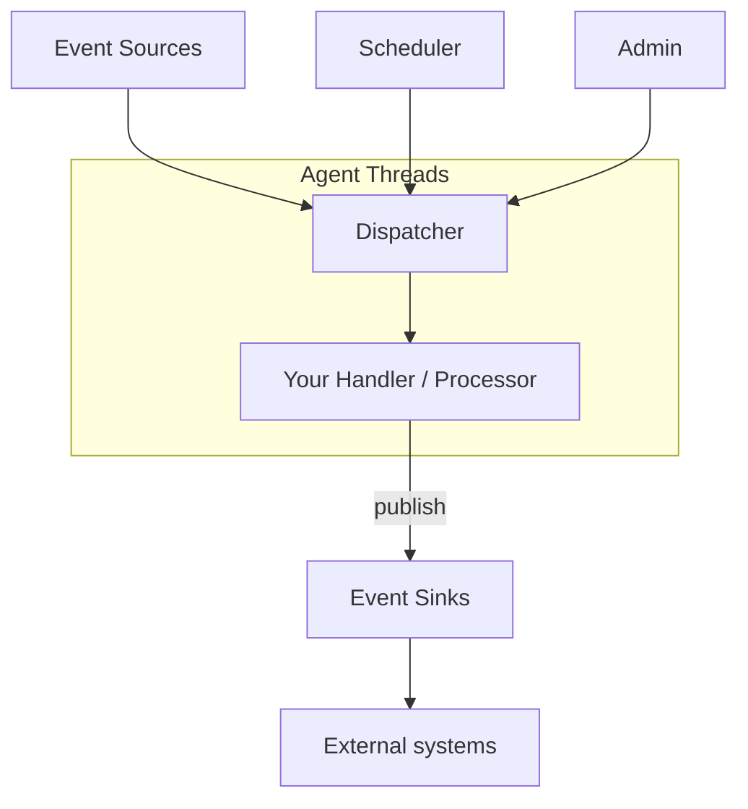

# Event Sinks: A High‑Level Guide

This guide introduces event sinks in Mongoose Server: what they are, where they fit, and how to choose the right options
for your use case. It covers agent vs non‑agent execution, delivery and subscription semantics from handlers to sinks,
mapping/serialization, batching and backpressure, retries/idempotency, and zero‑GC object pooling for outbound messages.

- Audience: engineers and architects new to Mongoose Server
- Read this with: "Event handling and business logic" for how handlers emit messages; see also the sink plugin guide

## What is an event sink?

An event sink adapts the server’s internal events or handler outputs to an external destination (files, sockets/HTTP,
message brokers, databases, consoles, other services). Its job is to:

- Receive messages from handlers/processors via the server’s dispatch/output mechanism
- Optionally transform or serialize messages for the target system (value mapping/encoding)
- Deliver to the external destination with appropriate buffering, batching, and backpressure management

Event sinks are plugins you register in MongooseServerConfig via EventSinkConfig. They participate in lifecycle and can
optionally run on an agent thread.

## Where do event sinks fit?

At runtime, handlers execute on agent threads and may publish messages to configured sinks. Sinks perform the last‑mile
I/O.

- Handlers run on agent threads and publish to sinks via the server’s output pathway
- Sinks handle outbound mapping/serialization and I/O to external systems

See also: [Event handling and business logic](event-processing-architecture.md).

## Agent vs non‑agent sinks

Sinks can run either on a server‑managed agent thread or on a user‑managed thread, similar to sources:

- Agent‑hosted sink (in‑agent):
    - Runs on an Agrona Agent thread managed by Mongoose Server (single‑threaded event loop per agent).
    - Suitable for non‑blocking I/O, buffering and batching logic executed cooperatively in doWork().
    - Caveat: avoid blocking I/O inside doWork(); choose an appropriate idle strategy.

- Non‑agent sink (out‑of‑agent):
    - Runs on a user/caller‑managed thread or relies on library callbacks/executors.
    - Prefer for blocking I/O drivers or when an external client runtime manages threads.

Choosing:

- Use in‑agent for cooperative, non‑blocking flush/write cycles with predictable pacing.
- Use non‑agent when writes block or the target client mandates its own threads.

See also: [Threading model](../architecture/threading-model.md)
and [Message sink plugin guide](../plugin/writing-a-message-sink-plugin.md).

## Lifecycle and publishing patterns

Common lifecycle for sinks mirrors other services:

- init(): cheap setup of sink state
- start(): open outbound resources (files, sockets, clients); prime buffers
- startComplete(): begin live publishing/flush scheduling
- doWork(): only for agent‑hosted; drain internal buffers, perform non‑blocking writes, flush batches
- stop()/tearDown(): flush and close; make idempotent

Publishing pathway:

- Handlers call output/publish logic that routes to configured MessageSink<?> instances
- EventSinkConfig allows a valueMapper to transform outbound messages before sink processing

## Delivery semantics and subscriptions

- Unicast (default): handlers publish to named sinks they are wired to in configuration
- Broadcast to sinks is uncommon; prefer explicit wiring by name for clarity and backpressure control
- Use meaningful sink names and group by destination or purpose (e.g., tradeLogFile, riskKafkaTopic)

Related:

- [Subscribe to named feeds](../how-to/how-to-subscribing-to-named-event-feeds.md) — for inbound subscription; for
  sinks, use explicit registration via EventSinkConfig

## Backpressure and slow‑consumer policy (sinks)

If a sink can’t keep up:

- Buffer and batch: accumulate messages and write in chunks to improve throughput
- Backoff/yield: for agent‑hosted sinks, employ IdleStrategy and bounded buffers
- Drop/coalesce: if semantics allow, drop older items or keep latest per key
- Metering/metrics: expose queue depths, batch sizes, error counts via admin

Guidance:

- Keep buffers bounded; define max batch size and flush intervals
- Prefer non‑blocking I/O or time‑bounded writes; avoid stalling agent loops

## Mapping and serialization (outbound)

Before writing to an external system, map or encode messages:

- Value mapping: transform domain objects to sink‑specific payloads (e.g., String, byte[], DTO)
- Serialization: JSON/CSV/Binary encoders; prefer zero‑copy or preallocated buffers on hot paths
- Validation and normalization: ensure required fields and formats for the target system

Recommendations:

- Keep mapping pure and fast; avoid allocations on the hot path
- Reuse encoders and buffers; pair with object pooling when possible

Related docs:

- [Transform events](../how-to/how-to-data-mapping.md)

## Batching, flushing, and retries

- Batching improves throughput but can add latency; tune batch size and flush cadence
- Flushing strategies: size‑based, time‑based, or explicit flush signals from handlers
- Retries: implement idempotent write logic; backoff between attempts; record failure metrics
- Ordering: preserve per‑destination ordering where required; document guarantees

## Idempotency and exactly‑once considerations

- Many sinks are at‑least‑once by default; design outbound payloads to be idempotent (keys, sequence numbers)
- For transactional systems (e.g., some brokers/DBs), prefer atomic/transactional APIs where available

## Zero‑GC object pooling for sinks

Use pools to stabilize latency and minimize allocations:

- Reuse outbound message envelopes, builders, and byte buffers
- Return objects to the pool after successful dispatch/flush
- Define ownership clearly: a pooled object shouldn’t be reused until the sink has completed with it

Resources in this repo:

- [Object pooling architecture](../architecture/object_pooling.md)
- [Zero‑GC object pooling](../how-to/how-to-object-pool.md)
- [Benchmarks and performance](../reports/server-benchmarks-and-performance.md)
-
Tests/benchmarks: [EventProcessingBenchmark.java](https://github.com/gregv12/fluxtion-server/blob/main/src/test/java/com/telamin/mongoose/benchmark/objectpool/EventProcessingBenchmark.java)
and [ObjectPoolServerIntegrationTest.java](https://github.com/gregv12/fluxtion-server/blob/main/src/test/java/com/telamin/mongoose/pool/ObjectPoolServerIntegrationTest.java)

Guidelines:

- Bound buffer sizes; expose configuration for batch size and flush interval
- Prefer immutable outbound payloads or defensive copies if multiple destinations are written concurrently

## Configuration pointers

Register sinks programmatically with EventSinkConfig:

- Provide the sink instance and name
- Optionally set a valueMapper for outbound transformation
- Optionally host as an agent with an IdleStrategy

See:

- [Message sink plugin guide](../plugin/writing-a-message-sink-plugin.md)
- [Plugin extension mechanism](plugin_extension_architecture.md)

## Putting it together: picking a sink design

1) Choose agent vs non‑agent

- In‑agent for cooperative, non‑blocking writes and flush scheduling
- Out‑of‑agent for blocking I/O or library‑managed clients

2) Decide buffering and backpressure policy

- Bounded queues, batch sizes, and backoff strategy

3) Define mapping/serialization

- Keep fast, allocation‑light; encode to destination format

4) Add pooling if needed

- Reuse outbound envelopes and buffers with clear ownership

5) Validate reliability requirements

- Retries, idempotency keys, ordering guarantees

## Quick checklist

- Sink execution: agent or non‑agent chosen intentionally
- Buffers/batches bounded and tuned; backpressure policy defined
- Mapping/serialization fast and validated for target system
- Pooling in place for hot paths; ownership defined
- Retries and idempotency considered; metrics exposed

## See also

- [Event handling and business logic](event-processing-architecture.md)
- [Message sink plugin guide](../plugin/writing-a-message-sink-plugin.md)
- [Object pooling](../architecture/object_pooling.md)
- [Threading model](../architecture/threading-model.md)
- [Server benchmarks and performance](../reports/server-benchmarks-and-performance.md)
