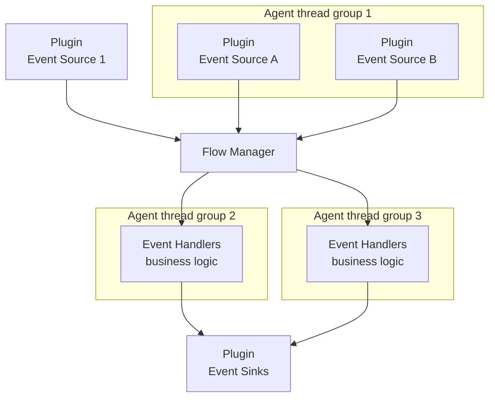

# Event Sources: A High‑Level Guide

This guide introduces event sources in Mongoose Server: what they are, where they fit in the system, and how to choose
the right options for your use case. It also explains agent vs non‑agent sources, broadcast delivery, idle/read
strategies, value mapping, and zero‑GC object pooling.

- Audience: engineers and architects new to Mongoose Server
- Read this with: "Event handling and Business Logic" for how handlers/processors consume events

## What is an event source?

An event source adapts an external input (file, network socket, message queue, in‑memory feed, timers, etc.) into the
server’s internal event model. Its job is to:

- Connect to a producing system (I/O, memory, or service) and read data.
- Convert raw bytes/objects into domain events (value mapping / deserialization).
- Publish events into the server, where they are dispatched to agent threads running your handlers.

Event sources are plugins that you enable/configure in MongooseServerConfig. They integrate with the dispatcher and
duty‑cycle services so events are delivered deterministically to handlers.

## Where do event sources fit?

At runtime, the server owns infrastructure like event sources, sinks, scheduler, and admin services. Agents are the
execution units that process events in single‑threaded loops.

- Event sources feed the flow manager dispatchers.
- The Dispatcher routes events to one or more agents according to subscription and broadcast rules.
- Your handler/processor executes on the agent thread.

See also: [Event handling and business logic](event-processing-architecture.md) for how handlers are structured.

## Agent vs non‑agent event sources

Event sources can run either on a server‑managed agent thread or on a user‑managed thread.

- Agent event source (in‑agent):

    - Runs on an Agrona Agent thread managed by Mongoose Server (single‑threaded event loop per agent).
    - Publishes to a queue that the event handler agent reads; ordering per target agent is deterministic with a low‑overhead in‑process handoff.
    - Best for in‑memory feeds, synthetic/replay sources, or sources that can be polled cooperatively (non‑blocking).
    - Caveat: avoid blocking I/O inside doWork(); use non‑blocking reads and an appropriate idle strategy.
    - Customizable idle strategy (see below).

- Non‑agent event source (out‑of‑agent):

    - Runs on a user/caller‑managed thread (e.g., library callback, custom executor) and publishes into the server.
    - Ideal for blocking I/O, external listener callbacks, or high‑latency producers that shouldn’t run on an agent.

Choosing:

- Use in‑agent when you control a cooperative, non‑blocking poll; events are enqueued to the handler agent’s queue with deterministic per‑agent ordering.
- Use non‑agent when reads block or when an external library drives callbacks on its own threads.

See also: [Threading model](../architecture/threading-model.md) and [Event source plugin guide](../example/plugin/writing-an-event-source-plugin.md).

## Lifecycle and publishing patterns

Mongoose server supports a strict startup order for event sources, guidelines below for common patterns:

- init(): cheap setup
- start(): open resources; optionally enable pre-start caching via output.setCacheEventLog(true)
- startComplete(): switch to live publish; optionally dispatchCachedEventLog()
- doWork(): only for agent-hosted; perform non-blocking reads, publish or cache
- stop()/tearDown(): close resources; make idempotent

Publishing options via output:

- publish(item): map and route immediately
- cache(item): record in event log cache without dispatch
- setCacheEventLog(boolean): toggle cache
- dispatchCachedEventLog(): replay cache (commonly at startComplete)

## Event wrapping

Choose how items are enqueued and routed to handlers:

- SUBSCRIPTION_NOWRAP: raw mapped item to subscribed handlers only
- SUBSCRIPTION_NAMED_EVENT: wrap in NamedFeedEvent for subscribers (default)
- BROADCAST_NOWRAP / BROADCAST_NAMED_EVENT: deliver to all handlers regardless of subscription

Tips:

- Prefer NamedFeedEvent wrapping when multiple feeds coexist or you need feed metadata.
- For broadcast with mutable payloads, prefer broadcasting immutable snapshots to avoid cross-agent mutation hazards.

## Caching strategies

Use caching to cover startup gaps or to build initial state before live publishing:

- Pre-start cache (event log): enable in start(), cache() until startComplete(), then dispatchCachedEventLog().
- Last-value cache: store last value per key/feed to replay snapshots to new subscribers (implement in your source or
  alongside a publishing service).
- Snapshot then tail: bulk-load a snapshot, dispatch it, then switch to incremental events.

Guidance:

- Bound cache size if inputs can be unbounded; fail-fast or spill if necessary.
- Annotate cache entries with timestamps or sequence numbers when replay order matters.

## Slow-consumer policy

If target queues/handlers lag, apply a policy to avoid stalling publishers:

- Backoff (default): publisher yields/backoffs when queues are contended (internal default behavior).
- Drop or coalesce: selectively drop old items or coalesce updates (e.g., keep only latest per key) — implement at your
  source layer if semantics allow.
- Batch: accumulate small items and publish as a batch when lag is detected.
- Metering: instrument queue depths and publish rates; expose admin metrics.

Configuration hooks:

- Choose IdleStrategy appropriate to expected contention (BusySpin, Yielding, Sleeping).
- Consider timeouts or max-queue thresholds to trigger coalescing/drop.

## Broadcast delivery

Broadcast determines how a published event is delivered across agents/handlers:

- Unicast (default): event is routed to the agent(s) whose handlers are subscribed to that event type or feed name. If
  an event is targeted to a specific agent, others do not receive it.
- Broadcast: the same event instance (or mapped value) is delivered to all subscribed agents. Useful for configuration
  updates, reference data refresh, or market‑wide signals.

Implementation tips:

- Use named feeds and subscriptions for clarity when broadcasting.
- Ensure handlers are idempotent for broadcasted events.

Related docs:

- [Subscribe to named feeds](../example/how-to/how-to-subscribing-to-named-event-feeds.md)

## Idle/read strategies (read pacing)

Event sources can control how they read when no data is available. An idle strategy prevents busy spins or unnecessary
context switches and can shape latency/CPU usage.

Common strategies:

- Busy spin: lowest latency, highest CPU. Suitable for microburst in‑memory feeds.
- Yield/sleep backoff: reduce CPU when idle, rising latency as backoff increases.
- Block on I/O: let the OS block the read; pair with non‑agent sources so the agent isn’t stalled.
- Scheduler‑driven poll: use the Scheduler service to trigger cooperative polls at fixed or adaptive intervals.

See also:

- [Event source read strategy](../guide/read-strategy.md)
- [Threading model](../architecture/threading-model.md)

## Value mapping (deserialization and transformation)

Value mapping converts a raw input into the event type your handlers expect. This is often where you:

- Parse bytes/JSON/CSV into domain objects.
- Normalize and validate fields.
- Optionally fan‑out a single input to multiple typed events.

Recommendations:

- Keep mapping pure and fast; avoid allocations on the hot path.
- Use object pooling (below) or scalar reuse to eliminate garbage for recurring fields.
- Co-locate mappers with the event source plugin for locality, or use dedicated mapping utilities for reuse.

Related docs:

- [Transform events](../example/how-to/how-to-data-mapping.md)

## Zero‑GC object pooling for sources

For high‑throughput, low‑latency workloads, use object pools to reuse event instances and buffers:

- Pools reduce GC pressure and stabilize latency by reusing event objects, builders, or byte buffers.
- Pair pooling with careful value mapping to write into preallocated objects.
- Return objects to the pool when handlers finish processing or after dispatch completes (depending on ownership model).

Resources in this repo:

- [Object pooling architecture](../architecture/object_pooling.md)
- [Zero‑GC object pooling](../example/how-to/how-to-object-pool.md)
- [Benchmarks and performance](../reports/server-benchmarks-and-performance.md)
- Tests/benchmarks: [EventProcessingBenchmark.java]({{source_root}}/test/java/com/telamin/mongoose/benchmark/objectpool/EventProcessingBenchmark.java) and [ObjectPoolServerIntegrationTest.java]({{source_root}}/test/java/com/telamin/mongoose/pool/ObjectPoolServerIntegrationTest.java)

Guidelines:

- Be explicit about object ownership: the publisher should not reuse a pooled object until all consumers have completed,
  especially for broadcast. Consider copying scalar values for broadcast or employ reference counting.
- Avoid sharing mutable state across agents unless you broadcast immutable snapshots or defensive copies.

## Putting it together: picking a source design

1) Choose agent vs non‑agent

- In‑agent for cooperative, non‑blocking polls; out‑of‑agent for blocking I/O or independent listeners.

2) Decide delivery mode

- Unicast for targeted feeds; broadcast for global updates.

3) Select an idle/read strategy

- Busy spin for ultra‑low latency; backoff or blocking for balanced CPU; scheduler‑driven for predictable pacing.

4) Define value mapping

- Keep mapping pure, fast, and allocation‑light. Consider schema evolution and validation.

5) Introduce pooling if needed

- Reuse event instances and buffers. Define clear lifecycle/ownership around dispatch and broadcast.

## Configuration pointers

- Register event source plugins in MongooseServerConfig or via YAML, using existing plugin extension points:
  - [Event source plugin](../example/plugin/writing-an-event-source-plugin.md)
  - [Publishing service plugin](../example/plugin/writing-a-publishing-service-plugin.md)
  - [Typed invoke publishing service](../example/plugin/writing-a-typed-invoke-publishing-service-plugin.md)
- For handler wiring and subscriptions, see [Event handling and business logic](event-processing-architecture.md) and
  [Subscribe to named feeds](../example/how-to/how-to-subscribing-to-named-event-feeds.md).

## Quick checklist

- Source runs in agent or out-of-agent? Chosen intentionally.
- Delivery mode: unicast or broadcast? Handlers idempotent if broadcast.
- Idle strategy: busy, backoff, blocking, or scheduler? Fits latency/CPU budget.
- Value mapping: minimal allocations; validated; version-aware.
- Pooling: zero‑GC path for hot flows; ownership well-defined.

## See also

- [Event handling and business logic](event-processing-architecture.md)
- [Event source read strategy](../guide/read-strategy.md)
- [Object pooling](../architecture/object_pooling.md)
- [Event source plugin guide](../example/plugin/writing-an-event-source-plugin.md)
- [Threading model](../architecture/threading-model.md)
