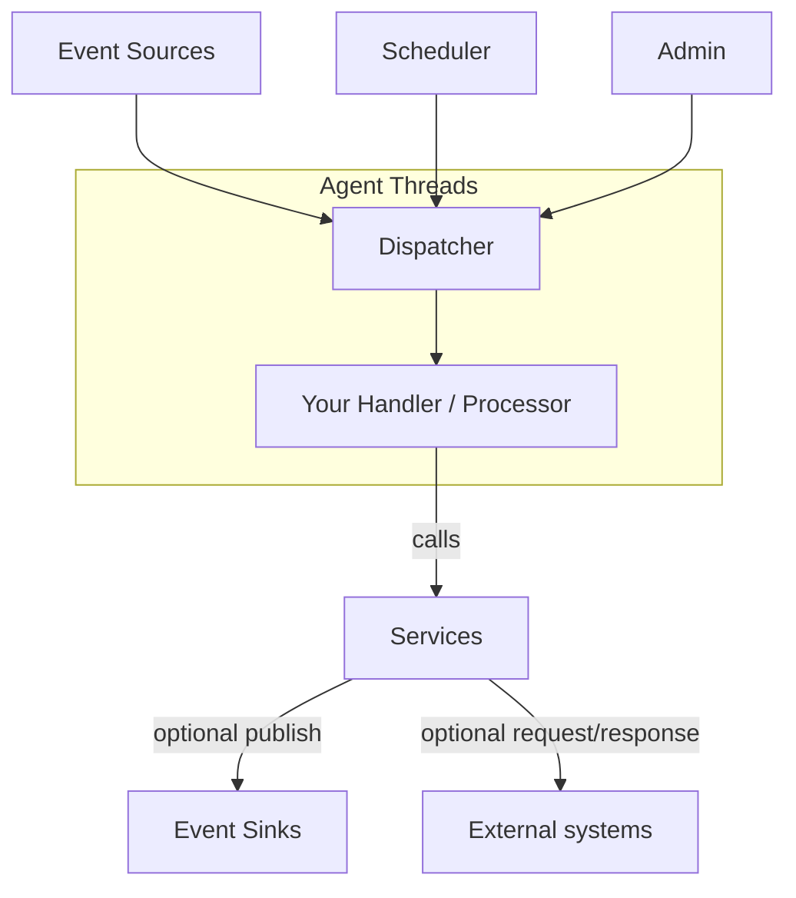

# Services: A High‑Level Guide

This guide introduces services in Mongoose Server: what they are, where they fit in the system, and how to use them to
provide reusable functions or to wrap request/response style programming.

- Audience: engineers and architects designing reusable capabilities for handlers/processors
- Read this with: "Event handling and business logic" for how handlers call services and consume results

## What is a service?

A service encapsulates reusable functionality that can be invoked by handlers/processors or other services. Services are
ideal for:

- Cross‑cutting capabilities (caching, lookups, reference data, validation, auth, metrics)
- Integrations that expose a typed API (HTTP/Kafka clients, DB accessors, file writers)
- Wrapping request/response style operations while integrating with the server’s event/threading model

In Mongoose Server, services are registered components that participate in lifecycle (init/start/stop/tearDown), can be
injected or looked up from the processing context, and may optionally run on an agent thread if they need their own
cooperative work loop.

## Where do services fit?

At runtime, handlers execute on agent threads. Services live alongside server infrastructure (sources, sinks, scheduler,
admin) and are accessed by handlers via the context or direct injection. Services may also publish events or write to
sinks.

- Handlers call Services for reusable logic or to access external systems
- Services can be pure in‑memory utilities or wrappers around I/O clients
- Services can optionally publish events or send messages to sinks

See also: [Event handling and business logic](event-processing-architecture.md).

## Agent vs non‑agent services

Most services do not need their own agent thread. However, when a service must run a cooperative loop (periodic flush,
retry, housekeeping), you can host it on an agent thread.

- Agent‑hosted service (in‑agent):
    - Runs on an Agrona Agent thread managed by Mongoose Server (single‑threaded event loop per agent)
    - Suitable for non‑blocking periodic tasks (e.g., retry queues, background refresh, buffered flush)
    - Caveat: avoid blocking I/O inside doWork(); select an appropriate IdleStrategy

- Non‑agent service (out‑of‑agent):
    - No doWork loop; invoked directly from handlers or other services
    - Use external client threads for blocking I/O, or design async callbacks that publish back into the server

Choosing:

- Prefer non‑agent for simple, synchronous utilities or thin wrappers where calls are quick
- Use agent‑hosted when you own a cooperative loop or want predictable flush/retry pacing without blocking handler
  threads

See also: [Threading model](../architecture/threading-model.md)
and [Service plugin guide](../example/plugin/writing-a-service-plugin.md).

## Threading and invocation

- Synchronous calls: Service methods invoked from a handler run on the caller thread — typically the handler’s agent
  thread. Keep these calls fast; do not block the agent loop with long or blocking I/O. Prefer quick in‑memory work or
  enqueue work to another thread if needed.
- Asynchronous responses: If an operation is long‑running or I/O bound, use one of the following patterns:
    - Callback event: perform the work off‑thread (e.g., client callback or executor) and publish a typed response event
      back into the server. Handlers subscribe to the response type and process it deterministically on the agent
      thread.
    - Future/Promise: return a CompletableFuture or similar; complete it off‑thread. If handlers must observe the result
      on the agent thread, have the completion stage publish a response event into the dispatcher instead of calling
      handler code directly.
    - Scheduler assisted: for periodic or deferred completions, schedule a timer and publish results when due.
    - See [Service as a publishing event source](../example/plugin/writing-a-publishing-service-plugin.md) guide for more
      details.

## **Thread safety warning**:

If your service is agent‑hosted (has a doWork loop) or uses its own threads/executors, it must
be thread safe. Calls to your service will be on the caller thread, Guard shared state, avoid unsynchronized mutable
cross‑thread access, and prefer immutable messages.

Never block inside doWork(); use non‑blocking operations and an appropriate IdleStrategy.

See also:
[Threading model](../architecture/threading-model.md) and
[Event handling and business logic](event-processing-architecture.md)

## Lifecycle and invocation patterns

Services follow the standard lifecycle and expose callable APIs:

- init(): prepare state; wire dependencies
- start(): open resources (clients, pools, files); schedule tasks if needed
- startComplete(): begin live operations; enable caches or warmups
- doWork(): only for agent‑hosted services; run non‑blocking periodic work
- stop()/tearDown(): close resources; idempotent cleanup

Common invocation patterns from handlers:

- Fire‑and‑forget: handler calls a service method (e.g., cache.put, metrics.increment)
- Request/response (sync): handler calls service.get(key) and uses the return value
- Request/response (async): handler submits a request; service completes via a callback or future/promise
- Publish‑through: service maps and publishes results/events to sinks or back into the dispatcher

Related plugin guides:

- [Service plugin](../example/plugin/writing-a-service-plugin.md)
- [Service plugin as event feed](../example/plugin/writing-a-publishing-service-plugin.md)
- [Service plugin with custom dispatch](../example/plugin/writing-a-typed-invoke-publishing-service-plugin.md)

## Request/response design

When wrapping request/response:

- Define clear execution context: avoid blocking the agent thread; use non‑blocking clients or external threads
- Timeouts and retries: configure per‑call budgets; use backoff strategies
- Idempotency and correlation: add request IDs/correlation keys; ensure handler can correlate responses
- Delivery of responses: choose direct returns (sync), callbacks, or publishing typed events back to handlers

Tips:

- For async responses, consider publishing a typed response event and subscribing handlers to it for deterministic
  processing on the agent thread
- For sync lookups that are fast and local (e.g., in‑memory cache), direct returns are fine

## Data mapping and validation

- Map request objects to client‑specific payloads (DTOs, byte[]); validate required fields
- Map responses back to domain types expected by handlers
- Keep mapping fast and allocation‑light; reuse encoders/decoders

Related docs:

- [Transform events](../how-to/how-to-data-mapping.md)

## Caching strategies

Many services maintain caches to reduce latency and load:

- Last‑value or key‑value cache for reference/lookup data
- Snapshot‑then‑tail: load a snapshot at start, then apply incremental updates from sources
- Expiration/refresh policies; background refresh via an agent‑hosted service if needed

Guidance:

- Bound cache sizes and define eviction policies
- Expose cache metrics; consider admin commands for inspection

## Backpressure, timeouts, and retries

- For outbound calls, set sensible timeouts; use bounded queues
- Apply retry with backoff and jitter; cap attempts and expose metrics
- For high‑rate calls, coalesce or batch when semantics allow

## Zero‑GC object pooling for services

Use pooling to minimize allocations on hot paths:

- Reuse request/response envelopes, DTOs, and byte buffers
- Return objects to pools when work completes; define clear ownership
- Combine with mapping that writes into preallocated objects

Resources in this repo:

- [Object pooling architecture](../architecture/object_pooling.md)
- [Zero‑GC object pooling](../how-to/how-to-object-pool.md)
- [Benchmarks and performance](../reports/server-benchmarks-and-performance.md)
-

Tests/benchmarks: [EventProcessingBenchmark.java]({{source_root}}/test/java/com/telamin/mongoose/benchmark/objectpool/EventProcessingBenchmark.java)
and [ObjectPoolServerIntegrationTest.java]({{source_root}}/test/java/com/telamin/mongoose/pool/ObjectPoolServerIntegrationTest.java)

## Configuration pointers

- Register services using MongooseServerConfig builder or via plugin configuration
- For agent‑hosted services, configure agent(name, idleStrategy) where supported by the specific config API
- Use the service plugin guides for wiring examples and lifecycle details

See:

- [Service plugin](../example/plugin/writing-a-service-plugin.md)
- [Publishing service plugin](../example/plugin/writing-a-publishing-service-plugin.md)
- [Typed invoke publishing service](../example/plugin/writing-a-typed-invoke-publishing-service-plugin.md)
- [Plugin extension mechanism](plugin_extension_architecture.md)

## Quick checklist

- Service type: simple utility vs. request/response wrapper chosen intentionally
- Threading: avoid blocking agent loops; use agent hosting only for cooperative work
- Timeouts/retries: defined and bounded; metrics exposed
- Mapping: fast, validated; reuse buffers/DTOs
- Caching: bounds and refresh policies; observability in place
- Pooling: ownership defined; zero‑GC path for hot flows

## See also

- [Event handling and business logic](event-processing-architecture.md)
- [Threading model](../architecture/threading-model.md)
- [Service plugin guide](../example/plugin/writing-a-service-plugin.md)
- [Server benchmarks and performance](../reports/server-benchmarks-and-performance.md)
