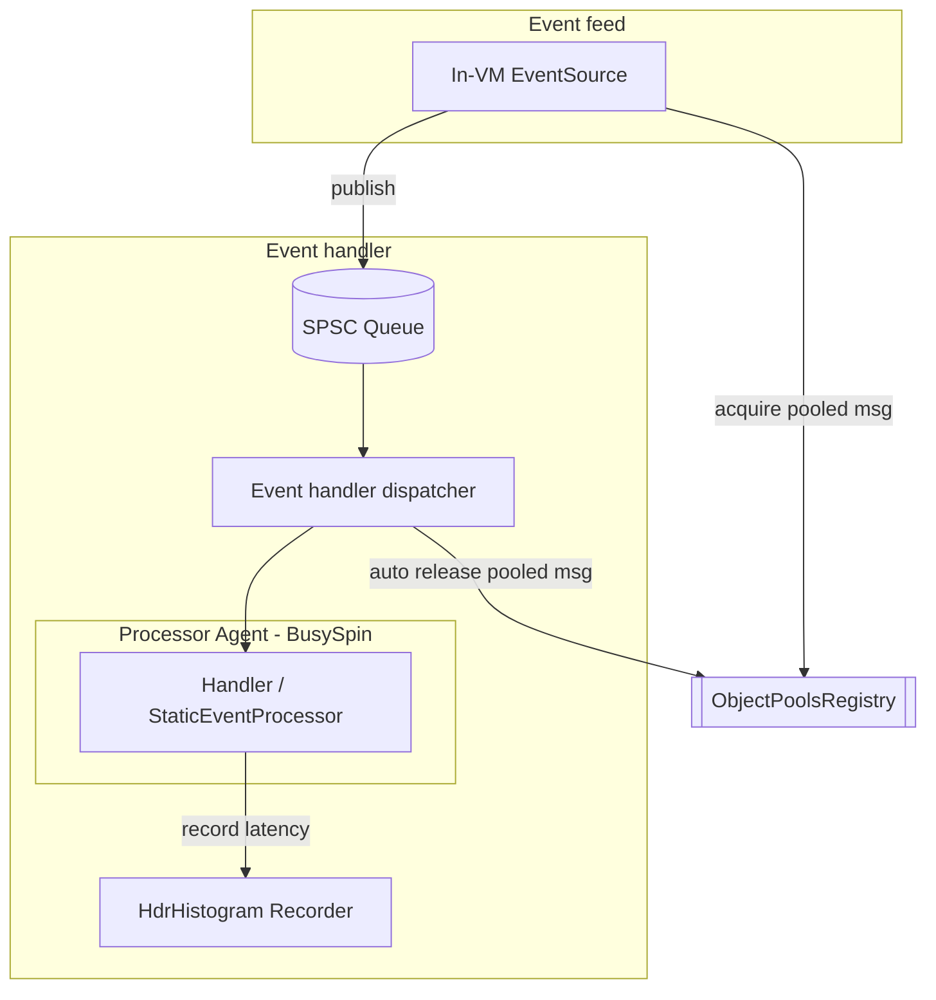
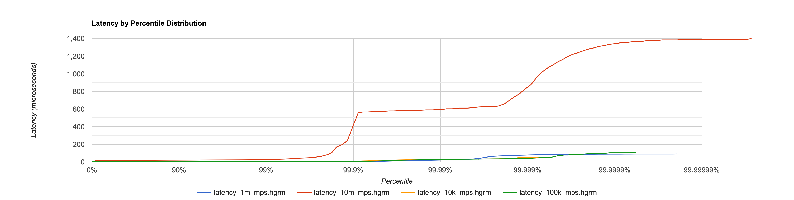
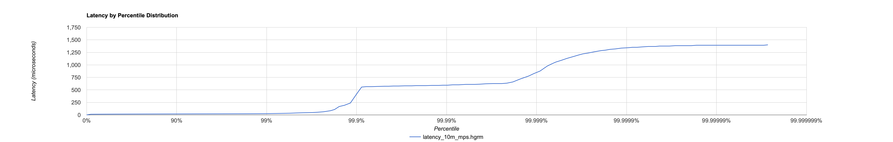
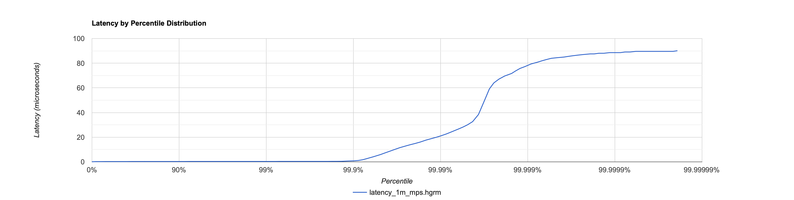

# Mongoose Server Benchmarks and Performance

Summary:

- Throughput: Sustains ~10 million messages per second (10M mps) in steady state.
- Latency: at 1M mps — Avg ≈ 270 ns, p99.999 ≈ 81 µs, Max ≈ 90.1 µs.
- In built batching boosts throughput but lifts median and tail latencies; distributions shift right with heavier tails.
- Memory: Zero‑GC hot path via pooled events; stable heap with no per‑operation allocations in steady state.

This page summarizes benchmark results and observations for the Mongoose Server using the object pool and in-VM event flow.

Source of results:
- Data files: `*.hgrm` under this directory were produced by running the test/benchmark [BenchmarkObjectPoolDistribution.java]({{source_root}}/test/java/com/telamin/mongoose/benchmark/objectpool/BenchmarkObjectPoolDistribution.java) in report mode.
- Visualizations: Histogram PNGs in this folder were generated from those HdrHistogram output files.

## Test setup at a glance
- Event flow: In-VM EventSource -> server event pipeline -> handler.
- Object pooling: Messages are acquired from the global ObjectPoolsRegistry, enabling zero per-operation allocations in steady state.
- Batching: The server supports batching in parts of the pipeline for throughput; this impacts latency distribution (see below).
- Threading: Busy spin agents with best-effort core pinning where available.
- Machine: Apple Mac (laptop/desktop class). Note: macOS typically lacks strict CPU isolation/affinity controls compared to some Linux setups.

### Diagram: High-level benchmark setup



Notes:

- Messages are pooled via ObjectPoolsRegistry; publisher acquires and recycles objects to achieve Zero-GC.
- Publication uses a single-producer/single-consumer queue into the server; the processor runs on a busy-spin agent (best-effort core pinning on host).
- Latency is measured end-to-end (publish to handler) and recorded via HdrHistogram for later visualization.

## Headline results
- Throughput: The server sustains approximately 10 million messages per second (10 M mps) in steady state in this setup.
- Latency characteristics: As batching is enabled to drive throughput, the average and tail latencies increase. This is visible as a right-shift and heavier tail in the latency histograms and percentile distributions.
- Jitter: Because the measurements were taken on a Mac that does not support hard CPU isolation, OS jitter and background activity are visible in the higher percentiles (e.g., p99, p99.9), as occasional spikes.

## Memory and heap usage (Object Pooling)

The example program [PoolEventSourceServerExample.java]({{source_root}}/test/java/com/telamin/mongoose/example/objectpool/PoolEventSourceServerExample.java) publishes pooled events at very high rates and periodically prints heap and GC statistics. A representative snippet of its output:

```
Processed 12000000 messages in 252 ms, heap used: 23 MB, GC count: 0
Processed 13000000 messages in 254 ms, heap used: 23 MB, GC count: 0
Processed 14000000 messages in 253 ms, heap used: 23 MB, GC count: 0
Processed 15000000 messages in 251 ms, heap used: 23 MB, GC count: 0
Processed 16000000 messages in 251 ms, heap used: 23 MB, GC count: 0
Processed 17000000 messages in 250 ms, heap used: 23 MB, GC count: 0
Processed 18000000 messages in 250 ms, heap used: 23 MB, GC count: 0
```

Analysis:

- The heap usage remains essentially flat (~23 MB) while tens of millions of messages are processed, and the GC collection count stays at 0 over multiple million‑message windows.
- The publish loop targets roughly a 250 ns interval per message (≈4 million messages/second). At this rate, any per‑message heap allocation would quickly trigger GC activity and growing heap usage. The flat heap and Zero‑GC behavior demonstrate that pooled events eliminate per‑operation allocations in the hot path.
- This behavior directly supports the zero‑GC design: pooled messages (BasePoolAware) are recycled; the framework acquires/releases references across queues and handlers, returning objects to the pool at end‑of‑cycle.

For implementation details of the pooling approach, see the guide: [How to publish pooled events](../how-to/how-to-object-pool.md).

## Files in this directory
- HdrHistogram raw distributions (nanoseconds):
  - [`latency_10k_mps.hgrm`](latency_10k_mps.hgrm) view as a [`chart`](Histogram_1k_10k_1M_mps.png)
  - [`latency_100k_mps.hgrm`](latency_100k_mps.hgrm)  view as a [`chart`](Histogram_1m_mps.png)
  - [`latency_1m_mps.hgrm`](latency_1m_mps.hgrm)  view as a [`chart`](Histogram_10m_mps.png)
  - [`latency_10m_mps.hgrm`](latency_10m_mps.hgrm)  view as a [`chart`](Histogram_all_mps.png)

You can open the `.hgrm` files with HdrHistogram tooling or any text editor to inspect percentile distributions.

## Throughput vs. latency: what to expect
- At lower message rates (e.g., 10k–100k mps), per-event latency is typically lower and the distribution tighter.
- At 1M mps, latency begins to climb, but percentiles remain tight on a quiet system.
- At 10M mps, the pipeline efficiency improves thanks to batching, but individual event latency rises, and high-percentile outliers become more apparent due to queueing effects and batch windows.

This is an inherent trade-off: batching amortizes overhead and increases throughput, but it delays some events waiting for their batch, lifting p50/p90 and especially tail percentiles.

All message rates combined:

[](Histogram_all_mps.png)

In this combined view, the 10M mps line shows the highest sustained throughput, achieved by enabling batching in parts of the pipeline. The side effect of batching is visible as a right‑shifted latency distribution with heavier tails: individual events can wait for a batch window, increasing p50/p90 and especially the p99+ percentiles compared to lower message rates.

## Throughput (10M mps)
This section isolates the 10 million messages per second test as a throughput-focused run:

- Goal: Maximize sustained message rate through the server pipeline.
- Technique: Enable batching in parts of the pipeline; agents run with BusySpin idle strategies and best‑effort core pinning.
- Outcome: ~10M messages/sec steady state on a Mac host.
- Side effect: Higher median and tail latencies compared to lower-rate runs due to batching and queueing (events may wait for a batch window).

10M mps latency distribution (from the corresponding .hgrm):

[](Histogram_10m_mps.png)

Notes:
- Use `.hgrm` data (latency_10m_mps.hgrm) to regenerate or further analyze the percentile distribution.
- On macOS, lack of strict CPU isolation introduces visible jitter in top percentiles; Linux with CPU shielding typically yields tighter tails.

## Latency (1M mps)

This section focuses on the latency characteristics at 1 million messages per second:

- Based on latency_1m_mps.hgrm — Avg ≈ 270 ns (0.00027 milliseconds), p99.999 ≈ 81 µs, Max ≈ 90.1 µs.
- Units and interpretation: the `.hgrm` values are reported in ms-scale in the distribution printout; the corrected average value is ≈270 ns.
- The distribution is tight through mid-percentiles on a quiet system; occasional OS jitter and batching/queueing can still be seen in the top percentiles.
- With batching disabled or minimal, latency is lower and tighter; enabling batching for throughput can shift the distribution right and accentuate tails.

1M mps latency distribution:

[](Histogram_1m_mps.png)

Use the `.hgrm` data (latency_1m_mps.hgrm) to regenerate or further analyze the percentile distribution and exact percentiles.

## Assessment: Is this a high‑performance Java server?

Yes. With Avg ≈ 270 ns and p99.999 ≈ 81 µs (Max ≈ 90.1 µs) at 1M mps, Mongoose Server exhibits excellent in‑JVM event‑flow latency while sustaining high throughput:

- Throughput: ~10M msgs/sec achievable by leveraging batching and zero‑GC pooled events.
- Median/mean: Sub‑microsecond mean at 1M mps is exceptional for Java hot paths.
- Tails: High percentiles in the tens of microseconds range are competitive with top Java stacks (e.g., Aeron/Disruptor/Chronicle) for similar single‑hop in‑process flows.
- Environment: These figures were obtained on macOS without strict CPU isolation; on a tuned Linux host with isolated, core‑pinned agents, expect tails to tighten further.

Trade‑off: Batching raises throughput but can increase per‑event latency and broaden tails. For ultra‑low‑latency SLAs, reduce batching and reserve dedicated cores; for maximum throughput, increase batching with awareness of the latency impact.

## Methodology notes
- Each measurement run uses pooled message instances (BasePoolAware) to avoid transient allocations.
- End-to-end latency measured from publish to handler receipt; distributions recorded with HdrHistogram.
- On macOS, core pinning and isolation are best-effort only; background noise can impact the top percentiles (p99+). On Linux with CPU isolation and `taskset`/`cset`, expect tighter tails.

## Reproducing
- Run: `BenchmarkObjectPoolDistribution` in report mode from your IDE or CLI.
- Ensure JIT warm-up and steady-state before collecting `.hgrm` distributions.
- Copy or link the generated `.hgrm` files into this directory. Update or regenerate the accompanying charts if needed.

## Takeaways
- Based on sub-microsecond average latency at 1M mps (≈270 ns) and strong high-percentile performance with zero‑GC hot paths, this is world‑class performance for a Java in‑JVM event processing server.
- Mongoose Server can sustain ~10 million msgs/sec in this configuration on commodity hardware by leveraging batching and Zero‑GC pooled events.
- Latency distributions broaden with increased batching; tune batch sizes and idle strategies according to your SLA (throughput vs. latency).
- For production-grade latency characterization, run on a Linux host with CPU isolation to reduce OS jitter and tighten the high-percentile tail.