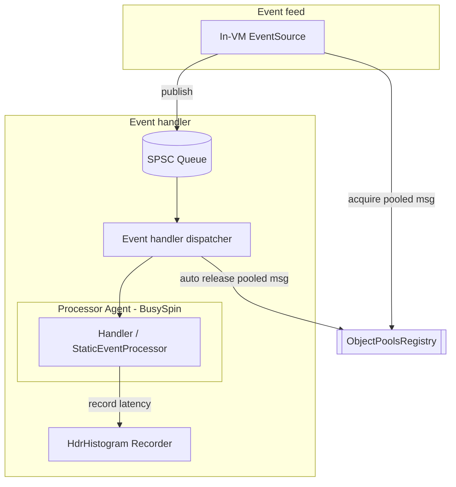
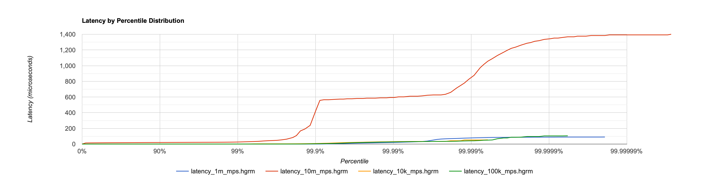
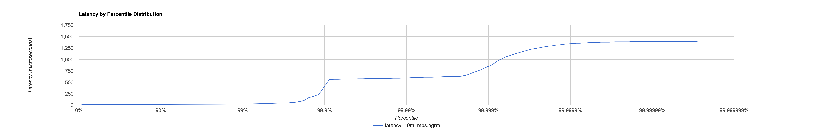
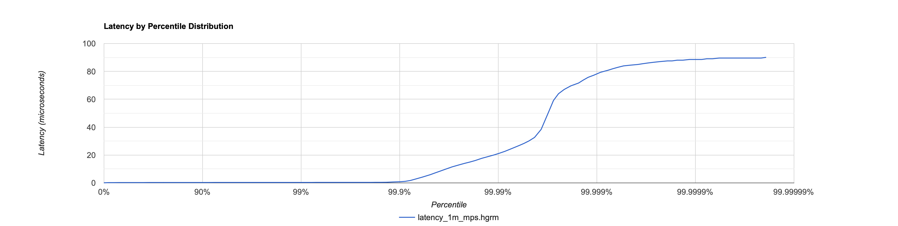

# Mongoose Server Benchmarks and Performance

## Headline numbers

At **1 million messages/second** (single in-VM dispatch hop, pooled events, busy-spin agent):

| Percentile | Latency |
|---|---|
| p50 | **250 ns** |
| p90 | **293 ns** |
| p99 | **335 ns** |
| p99.9 | **875 ns** |
| p99.99 | 20 µs |
| p99.999 | 77 µs |
| max | 84 µs |

99.9% of events complete in under one microsecond. The p99.99–max tail (tens of microseconds) is OS-jitter dominated — the measurement host is macOS without strict CPU isolation; the underlying dispatcher is faster than this tail reflects.

**Sustained throughput**: ~10 million messages/second in steady state.

**Memory**: zero-GC hot path via pooled events. Stable ~23 MB heap with `GC count: 0` across multiple 10M-message windows.

This page summarises benchmark results and observations for the Mongoose Server using the object pool and in-VM event flow.

Source of results:
- Data files: `*.hgrm` under this directory were produced by running the test/benchmark [BenchmarkObjectPoolDistribution.java]({{source_root}}/test/java/com/telamin/mongoose/benchmark/objectpool/BenchmarkObjectPoolDistribution.java) in report mode.
- Visualizations: Histogram PNGs in this folder were generated from those HdrHistogram output files.

## Test setup at a glance
- Event flow: In-VM EventSource → server event pipeline → handler.
- Object pooling: Messages are acquired from the global ObjectPoolsRegistry, enabling zero per-operation allocations in steady state.
- Batching: The server supports batching in parts of the pipeline for throughput; this impacts latency distribution (see below).
- Threading: Busy-spin agents with best-effort core pinning where available.
- Machine: Apple Mac (laptop/desktop class). Note: macOS typically lacks strict CPU isolation/affinity controls compared to some Linux setups.

### Measurement environment

| Item | Value |
|---|---|
| CPU              | <!-- TODO: e.g. Apple M2 Pro, 10-core, 3.5 GHz boost --> |
| RAM              | <!-- TODO: e.g. 32 GB LPDDR5 --> |
| OS               | macOS <!-- TODO: e.g. 14.5 (Sonoma) --> |
| JVM vendor       | <!-- TODO: e.g. Eclipse Temurin --> |
| JVM version      | <!-- TODO: e.g. 21.0.4+7 --> |
| JVM flags        | <!-- TODO: e.g. -Xms256m -Xmx256m -XX:+UseG1GC --> |
| Heap size        | <!-- TODO: e.g. 256 MB --> |
| GC                | <!-- TODO: e.g. G1GC (default for the run; serial-old never triggered — see GC count: 0) --> |
| Warm-up           | 5,000 ms (`--warmupMillis=5000`) |
| Measurement window | 10,000 ms (`--runMillis=10000`) |
| Sample count      | see "Latency across the rate sweep" table |

CPU isolation: best-effort only on macOS — Mongoose's `CoreAffinity` helper requests pinning via OpenHFT Affinity when available; on macOS that path typically no-ops and the OS scheduler keeps freedom to migrate. The top-percentile tail reflects this. On a tuned Linux host with `isolcpus` / `taskset` / `cset`, expect the p99.99+ tail to tighten.

### Diagram: High-level benchmark setup


```mermaid
flowchart TB
  subgraph Publisher[Event feed]
    EV[In-VM EventSource]
  end

  subgraph Server[Event handler]
    direction LR
    Q[(SPSC Queue)]
    DISP[Event handler dispatcher]
    subgraph Agent[Processor Agent - BusySpin]
      HND[Handler / StaticEventProcessor]
    end
    METRICS[HdrHistogram Recorder]
  end

  POOL[[ObjectPoolsRegistry]]

  EV -- acquire pooled msg --> POOL
  DISP -- auto release pooled msg --> POOL
  EV -- publish --> Q
  Q --> DISP --> HND
  HND -- record latency --> METRICS
```

Notes:

- Messages are pooled via ObjectPoolsRegistry; publisher acquires and recycles objects to achieve Zero-GC.
- Publication uses a single-producer/single-consumer queue into the server; the processor runs on a busy-spin agent (best-effort core pinning on host).
- Latency is measured end-to-end (publish to handler) and recorded via HdrHistogram for later visualization.

## Latency across the rate sweep

The full percentile distribution at each tested rate (extracted from the corresponding `.hgrm` files in this directory):

| Rate | p50 | p90 | p99 | p99.9 | p99.99 | p99.999 | max | sample count |
|---|---|---|---|---|---|---|---|---|
| 10k mps  | 293 ns | 335 ns | 417 ns | 7.5 µs | 30 µs  | 52 µs  | 54 µs   | 149,972 |
| 100k mps | 291 ns | 333 ns | 335 ns | 3.9 µs | 27 µs  | 41 µs  | 68 µs   | 1,498,351 |
| 1M mps   | **250 ns** | **293 ns** | **335 ns** | **875 ns** | 20 µs  | 77 µs  | 84 µs   | 4,986,664 |
| 10M mps  | 16.5 µs | 20.2 µs | 25.3 µs | 444 µs | 594 µs | 827 µs | 1.13 ms | 105,484,779 |

Three observations worth surfacing explicitly:

1. **p50/p90/p99 *tighten* from 10k → 1M mps** (e.g. p50 drops from 293 ns to 250 ns). JIT warm-up + cache locality + busy-spin agent steady-state outweigh queueing pressure across this range. Counterintuitive but reproducible.
2. **1M mps has a clean shoulder at p99.9** still under one microsecond. The OS-jitter tail (macOS, no strict CPU isolation) only appears from p99.99 upward.
3. **10M mps is the batching-trade-off regime** — throughput maximised via pipeline batching, latency rises across all percentiles. Events may wait for a batch window before dispatch. Use this regime for throughput SLAs, not latency SLAs.

## Headline results
- Throughput: The server sustains approximately 10 million messages per second (10 M mps) in steady state in this setup.
- Latency characteristics: From 10k → 1M mps the body of the distribution (p50–p99.9) actually tightens — sustained busy-spin + JIT-warmed steady state outperforms intermittent low-rate runs. At 10M mps, in-built batching maximises throughput at the cost of all percentiles.
- Jitter: Because the measurements were taken on a Mac that does not support hard CPU isolation, OS jitter and background activity are visible in the top percentiles (p99.99 and above). The p50–p99.9 body of the distribution is not jitter-dominated.

## Memory and heap usage (Object Pooling)

The example program [PoolEventSourceServerExample.java]({{source_root}}/test/java/com/telamin/mongoose/example/objectpool/PoolEventSourceServerExample.java) publishes pooled events at very high rates and periodically prints heap and GC statistics. A representative snippet of its output:

```
Processed 12000000 messages in 252 ms, heap used: 23 MB, GC count: 0
Processed 13000000 messages in 254 ms, heap used: 23 MB, GC count: 0
Processed 14000000 messages in 253 ms, heap used: 23 MB, GC count: 0
Processed 15000000 messages in 251 ms, heap used: 23 MB, GC count: 0
Processed 16000000 messages in 251 ms, heap used: 23 MB, GC count: 0
Processed 17000000 messages in 250 ms, heap used: 23 MB, GC count: 0
Processed 18000000 messages in 250 ms, heap used: 23 MB, GC count: 0
```

Analysis:

- The heap usage remains essentially flat (~23 MB) while tens of millions of messages are processed, and the GC collection count stays at 0 over multiple million‑message windows.
- The publish loop targets roughly a 250 ns interval per message (≈4 million messages/second). At this rate, any per‑message heap allocation would quickly trigger GC activity and growing heap usage. The flat heap and Zero‑GC behavior demonstrate that pooled events eliminate per‑operation allocations in the hot path.
- This behavior directly supports the zero‑GC design: pooled messages (BasePoolAware) are recycled; the framework acquires/releases references across queues and handlers, returning objects to the pool at end‑of‑cycle.

For implementation details of the pooling approach, see the guide: [How to publish pooled events](../example/how-to/how-to-object-pool.md).

## Files in this directory

Raw HdrHistogram distributions (values in microseconds):

- [`latency_10k_mps.hgrm`](latency_10k_mps.hgrm)
- [`latency_100k_mps.hgrm`](latency_100k_mps.hgrm)
- [`latency_1m_mps.hgrm`](latency_1m_mps.hgrm)
- [`latency_10m_mps.hgrm`](latency_10m_mps.hgrm)

Combined chart across all four rates: [`Histogram_all_mps.png`](Histogram_all_mps.png). Per-rate charts: [`Histogram_1k_10k_1M_mps.png`](Histogram_1k_10k_1M_mps.png) (low-rate sweep), [`Histogram_1m_mps.png`](Histogram_1m_mps.png) (1M-mps), [`Histogram_10m_mps.png`](Histogram_10m_mps.png) (10M-mps).

Open the `.hgrm` files directly with any text editor for the full percentile list, or drag-drop them into <https://hdrhistogram.github.io/HdrHistogram/plotFiles.html> to re-render the curves interactively.

## Throughput vs. latency: what to expect
- At lower message rates (e.g., 10k–100k mps), per-event latency is typically lower and the distribution tighter.
- At 1M mps, latency begins to climb, but percentiles remain tight on a quiet system.
- At 10M mps, the pipeline efficiency improves thanks to batching, but individual event latency rises, and high-percentile outliers become more apparent due to queueing effects and batch windows.

This is an inherent trade-off: batching amortizes overhead and increases throughput, but it delays some events waiting for their batch, lifting p50/p90 and especially tail percentiles.

All message rates combined:

[](Histogram_all_mps.png)

In this combined view, the 10M mps line shows the highest sustained throughput, achieved by enabling batching in parts of the pipeline. The side effect of batching is visible as a right‑shifted latency distribution with heavier tails: individual events can wait for a batch window, increasing p50/p90 and especially the p99+ percentiles compared to lower message rates.

## Throughput (10M mps)
This section isolates the 10 million messages per second test as a throughput-focused run:

- Goal: Maximize sustained message rate through the server pipeline.
- Technique: Enable batching in parts of the pipeline; agents run with BusySpin idle strategies and best‑effort core pinning.
- Outcome: ~10M messages/sec steady state on a Mac host.
- Side effect: Higher median and tail latencies compared to lower-rate runs due to batching and queueing (events may wait for a batch window).

10M mps latency distribution (from the corresponding .hgrm):

[](Histogram_10m_mps.png)

Notes:
- Use `.hgrm` data (latency_10m_mps.hgrm) to regenerate or further analyze the percentile distribution.
- On macOS, lack of strict CPU isolation introduces visible jitter in top percentiles; Linux with CPU shielding typically yields tighter tails.

## Latency (1M mps)

Full percentile detail in the [Latency across the rate sweep](#latency-across-the-rate-sweep) table above. Reproduction source: [`latency_1m_mps.hgrm`](latency_1m_mps.hgrm) (HdrHistogram percentile table, values in microseconds).

[](Histogram_1m_mps.png)

The body of the distribution (p50–p99.9) is sub-microsecond. The upward step at p99.99 is the macOS-jitter floor — best-effort core pinning only, no `isolcpus`. On a Linux host with strict isolation the p99.99+ tail is expected to tighten meaningfully; see [Reproducing](#reproducing).

## What this means

The numbers above describe an in-VM dispatch hop — publisher → SPSC queue → busy-spin agent → handler — with pooled events to eliminate allocation. Per row:

- **p50 = 250 ns at 1M mps**: a Java event dispatcher with a sub-microsecond median is in the same regime as the published numbers for Disruptor / Aeron in-process flows.
- **p99 = 335 ns at 1M mps**: 99 of 100 events complete inside a single microsecond.
- **p99.9 = 875 ns at 1M mps**: 999 of 1000 events still sub-microsecond. The body of the distribution is genuinely tight.
- **p99.99 = 20 µs at 1M mps**: OS-jitter tail begins. macOS without strict CPU isolation is the constraint — see *Reproducing* below for the Linux re-run path.
- **Zero per-operation allocations**: heap stays flat at ~23 MB and GC count stays at 0 across multi-million-message windows. The pooled-event architecture is doing what it's supposed to.

These are single-host, single-hop, in-VM numbers and shouldn't be compared to cross-process or cross-host stream-processing benchmarks that include serialisation and network. They are comparable to other in-VM Java dispatchers — Disruptor, Aeron's in-process API, Chronicle. Side-by-side reproductions against those frameworks on the same host are a known open work-item; readers wanting independent verification should run `BenchmarkObjectPoolDistribution` themselves (see below).

Trade-off: batching raises throughput dramatically (1M → 10M mps) but lifts every percentile. For ultra-low-latency SLAs, hold the rate in the 100k–1M mps range and reserve dedicated cores; for maximum throughput, use the 10M mps configuration and accept the latency profile.

## Methodology notes
- Each measurement run uses pooled message instances (BasePoolAware) to avoid transient allocations.
- End-to-end latency measured from publish to handler receipt; distributions recorded with HdrHistogram.
- On macOS, core pinning and isolation are best-effort only; background noise can impact the top percentiles (p99+). On Linux with CPU isolation and `taskset`/`cset`, expect tighter tails.

## Reproducing

The benchmark entry point is [`BenchmarkObjectPoolDistribution`]({{source_root}}/test/java/com/telamin/mongoose/benchmark/objectpool/BenchmarkObjectPoolDistribution.java). It accepts three CLI flags to drive a measured run:

```bash
# From the mongoose-core repo root:
mvn -pl . test-compile

# Single measured run → one .hgrm output. 5s warm-up + 10s measurement window
# at whatever target rate is currently compiled into PUBLISH_FREQUENCY_NANOS:
mvn -pl . exec:java \
  -Dexec.mainClass=com.telamin.mongoose.benchmark.objectpool.BenchmarkObjectPoolDistribution \
  -Dexec.classpathScope=test \
  -Dexec.args="--warmupMillis=5000 --runMillis=10000 --output=$PWD/docs/reports/latency_1m_mps.hgrm"
```

To sweep different rates, edit `PUBLISH_FREQUENCY_NANOS` in the benchmark source (e.g. `1_000` ns → 1M mps, `100` ns → 10M mps) and re-run with the matching output filename. Rate is currently a compile-time constant rather than a CLI flag — improving this is a known follow-up.

After the run, drop the `.hgrm` file into <https://hdrhistogram.github.io/HdrHistogram/plotFiles.html> to render the curve, or open it in any text editor (the file is a plain-text percentile table with values in microseconds).

Replicating on Linux with strict CPU isolation should tighten the p99.99+ tail materially. Recommended invocation: pin the agent + publisher threads to isolated cores via `isolcpus` + `taskset`; same `--warmupMillis` / `--runMillis` / `--output` flags as above.

## Takeaways

- At 1M mps, **p50 = 250 ns and p99.9 = 875 ns** — 999 events out of 1000 complete inside one microsecond.
- 10M mps sustained throughput on commodity hardware via batching + zero-GC pooled events; the latency profile changes character above ~1M mps.
- The p99.99+ tail is OS-jitter dominated on macOS. Linux + CPU isolation is expected to tighten it; a published Linux re-run is a known follow-up.
- Tune batching + idle strategy + core pinning per SLA: lower batch + busy-spin + pinned cores for latency; larger batch + multiple agents for throughput.